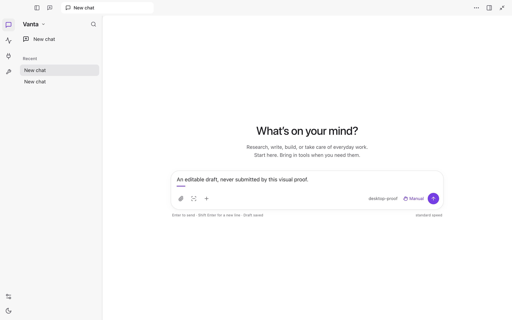
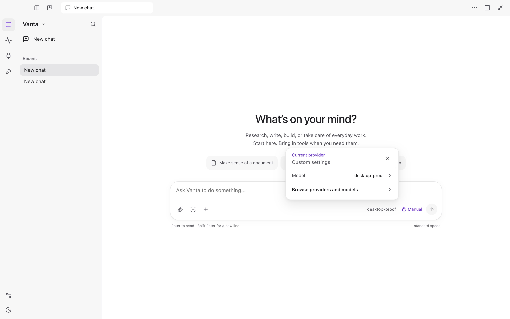

# Desktop quiet controls — October 3, 2026

## Outcome and scope

Continue ordinary Vanta on `codex/librechat-shell-adapter-20261002`, draft PR #60,
from `6406c8f74877ecdab80762f246cb48e8d13738b1`. The owner's new screenshot
shows that the prior window-level redesign still has heavy focused-composer,
starter-button and menu boundaries. This pass addresses those actual states;
it does not declare the whole ambient workflow finished.

Primary reference: the owner-supplied Codex screenshot. Preserve Vanta's name,
white/grey surfaces, violet accents, existing runtime and all approval boundaries.
No additional upstream source or private screenshot is copied into this repository.
The native Codex tool restriction remains respected.

## Reproduced source causes

- Composer focus changes the frame from `--line` to `--line-strong`, which is
  `#818189` in light appearance; this is the dark outline in the owner's screenshot.
- Starter actions use a visible border like a settings form.
- Model, access, tools, capture and chat-action menus inherit different strong
  borders and legacy heavy shadows instead of one restrained floating surface.
- Settings padding references undefined `--space-5`; actual fixture screenshots
  also show stretched Appearance buttons from grid/flex cross-axis alignment.

## Work and verification contract

Use soft decorative edges and shallow elevation, borderless secondary actions,
compact menu rows, and a localized composer focus cue. Keep text/icon contrast,
real keyboard focus, disabled/selected/error states and forced-colors affordances.
Inspect resting, focused, hovered, typed and open-menu states in the exact signed
package, not only a static empty screen. Retain both themes and narrow windows.

Parallel ownership is disjoint: one worker owns the three chat/control stylesheets;
one owns packaged proof helpers; one owns the demonstrated Settings token/layout
repair and its regression test. The parent owns integration, docs, installation
and publication. Only one packaged proof runner may run at a time.

## Evidence

The installed baseline reproduced the dark composer edge: its focused border
changed from RGB 216/216/220 to 129/129/137. The first candidate removed that
change and the starter outlines. Its open Tools menu exposed an 11.6px active
history-row strip; review also found the model menu detached from its trigger.
Both were corrected and exercised in the final package before installation.

### Iteration policy

The owner explicitly requested faster, scoped checks rather than repeatedly
running the entire repository suite. Subsequent UI iterations use the affected
component tests, renderer typecheck/build and this bounded package replay:

```sh
node scripts/desktop-chat-first-proof.mjs --quiet-controls-only
```

It records `scope: quiet-controls-only`, runs 14 startup/control checks and does
not run the unrelated runtime/approval/workspace replays. It retains the actual
visual-state and accessibility assertions, verifies package identity and makes
no provider request. This scope is not whole-application acceptance.

Already executed before that instruction: runtime/renderer typechecks; 265
Desktop tests; 14,510 full-suite tests (3 skipped); 7 installer tests; 7 roadmap
tests and projection check; 68-rule changed-proof Semgrep scan (no findings);
2,190-commit history and snapshot secret scan (no findings). All exited 0.
These are historical results for the pre-menu-repair candidate, not a claim
that the subsequent focused repairs received another full-suite run.

### Final scoped results

| Check | Command | Result |
| --- | --- | --- |
| Tools menu regression | `npx vitest run desktop-app/src/chat-first-tools-navigation.test.tsx` | 4 passed, exit 0; red observed before the repair |
| Model anchor and existing overlay contracts | `npx vitest run desktop-app/src/model-popover-position.test.ts desktop-app/src/overlays.test.tsx` | 15 passed, exit 0 |
| Renderer types | `npm run desktop:renderer:typecheck` | Exit 0 |
| Changed-file size | `lintFiles` on model-picker, model-popover-position, chat-first-tools-navigation and the two proof modules | 5 analyzed, no violations or missing files |
| Changed production security | `semgrep scan --config p/javascript --config p/typescript --metrics=off --error` on the three production menu modules | 74 rules, 3 files, zero findings, exit 0 |
| Signed candidate | `npm run desktop:pack` | Production renderer/kernel build, Developer ID signing and strict verification, exit 0 |
| Exact candidate interactions | `node scripts/desktop-chat-first-proof.mjs --quiet-controls-only` | 14 passed, zero provider requests, zero renderer errors, exit 0 |
| Guarded installation | Existing `installLocalDesktop` with proof-scope/hash and Developer ID guards | Installed exact candidate, prior bundle retained, exit 0 |

The scoped package replay covers both themes, typing/focus/hover, five open menu
surfaces, anchored model geometry, Tools Escape/outside dismissal and inert
restoration, 760px windows, Appearance insets and forced-colors. Serious/critical
accessibility findings were zero on the scanned states. Disposable non-Git
fixture directories produce retained Git diagnostics; these are not renderer errors.

Candidate and installed `app.asar` SHA-256:
`7187702268d81453443dcd09850c7f2397d69466926350b07e5f3c88e159484b`.
Installed `/Applications/Vanta.app` at `2026-10-03T09:23:24.163Z`.
Local rollback/receipt directory: `Vanta Local Updates/update-IrOsWr/`.
Previous archive `fff608f74b90ef00dc05b00a15af4e917047118746015c7235dc47708b3a7dc2`
is preserved, not deleted. The CLI checkout and operator configuration were not replaced.

Native installed-app observation: typed `Draft typing check — not sent.` into
the previously empty composer, observed visible text with the quiet frame, then
removed only that unsent diagnostic. Opened the actual Codex provider model/effort/
speed menu and observed it beside its trigger; no selection changed. Tools Escape
restored trigger focus and the sidebar. Appearance showed compact choices and
proper insets. Existing Full access remained unchanged. The app is left open.

### Actual candidate screenshots

These contain disposable fixture data only, not the owner's private history.




### Parallel next-track findings, not fixes in this package

- A read-only metadata probe confirmed Calculator exists at
  `/System/Applications/Calculator.app` outside Vanta's generated shell sandbox
  (exit 0), but the same `stat` inside it returns `Operation not permitted`
  (exit 1). This proves hidden bundle metadata, not the original launch failure.
  Preserve the protected system boundary; investigate a typed native-app launch
  capability rather than disabling sandboxing.
- Pure in-memory approval reproduction confirmed an ordinary saved allow can
  be changed back to ask by a user profile's `always_ask` preference. Explicit
  denial, kernel blocks and protected one-way prompts remain enforced. No
  operator profile was read, so this is not Jason's diagnosed profile state.
- Source review found the CLI offers a remembered choice on unnamed inner
  browser approvals that cannot persist it; Desktop already gates that choice.
  The next bounded CLI correction should use the same eligibility without
  bypassing domain/session/risky-action approvals.

Exact Codex parity, every legacy Settings control's styling and the whole
ambient workflow are not accepted by these bounded observations.

## Unchanged product boundaries

No permissions, providers, credentials, live-account actions, native-control
policies or user records are changed. The parent's unsent Calculator diagnostic
was removed without sending it. Native computer-control acceptance, normal-profile
remembered approvals, coherent ambient follow-through, dependency security and
the deferred unfamiliar-person run remain separate open gates. No roadmap status
will be promoted by this visual pass. Actions stays disabled; no merge, release,
notarization, deployment, tag or force push is authorized by this change.
