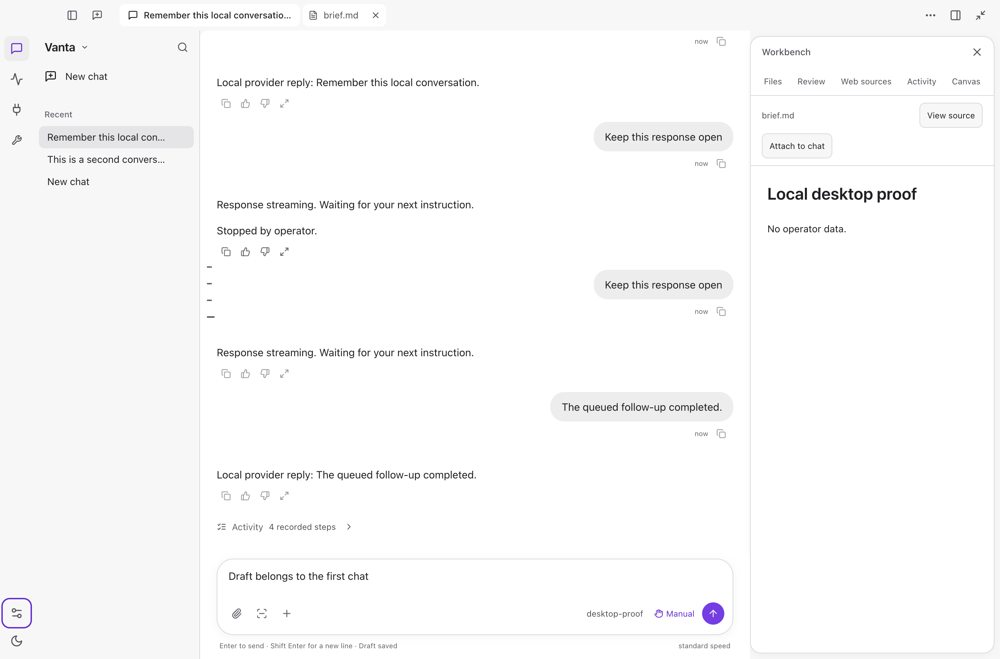
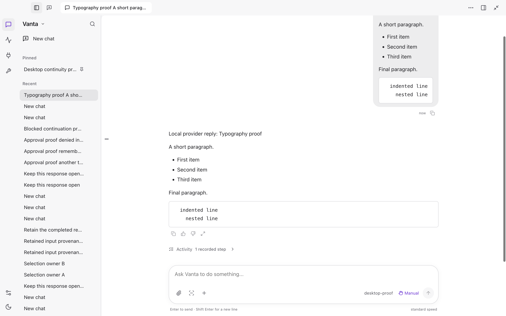

# Desktop reference match — October 3, 2026

Continuation: the owner subsequently identified heavy focused controls and menu
borders in this candidate. The [quiet-controls repair](desktop-quiet-controls-2026-10-03.md)
records that follow-up, including the reproduced defect and later package evidence.
The hashes and results below remain the historical window-hierarchy checkpoint.

## Contract

The owner's primary reference is the supplied Codex Desktop screenshot, not a
generic chat redesign. Retain ordinary Vanta, its white/grey appearance, violet
accent, agent runtime, stored conversations, approvals and tools. Rebuild the
window hierarchy rather than adding another set of decorative cards. Do not
import Codex branding, private conversation data or unsupported features.

Source baseline: `470632df5d58058400b680cc687e7a2b1e5e51d7`, on
`codex/librechat-shell-adapter-20261002`. This continues draft PR #60.

The native UI tool explicitly refused access to `com.openai.codex`. That boundary
was not bypassed. The supplied 3232×2102 screenshot is the primary visual source;
the screenshot itself is private and is not included in the repository. The
expected 2× macOS scale is inferred, not confirmed from the blocked live window.
Dimensions below are normalized implementation targets, not claimed extracted
Codex source constants. Pixel-identical equivalence is not established.

Supplemental references inspected in Mobbin:
[ChatGPT conversation](https://mobbin.com/screens/fc303bbc-5d5f-4ffc-b3ce-065abc9693bc)
and [ChatGPT group conversation](https://mobbin.com/screens/fa707eb9-8ecd-48e1-b94d-647c03a08bc6).
They support the quiet sidebar, bottom composer and unboxed assistant text;
they do not override the owner's Codex target. LibreChat's actual Markdown and
ToolCallGroup source at `f10b1d91f1eee3a2c82d5247bf620351486b7c1b` was also read.
Existing MIT attribution remains; no additional upstream source is copied here.

## Multi-pass extraction and implementation

| Dimension | Visible reference | Vanta target | Confidence |
| --- | --- | --- | --- |
| Color | White reading surface, soft grey chrome, quiet separators | Existing semantic white/grey tokens; Vanta violet for identity/action/focus | Observed roles; exact values retained from Vanta |
| Type | Native sans, modest title, body and compact navigation | System SF; 15px body, 14px history, 13px window tabs, 12px metadata | Inferred normalized sizes |
| Spacing | One top window bar, narrow rail, dense list, shared reading/input edges | 44px bar, 48px rail, 240px default history, 32px rows, 768px reading measure, 24/16px gutters | Observed hierarchy; inferred sizes |
| Shape | Small selected-row/tab rounding, generously rounded composer and contextual panel | 8px rows/tabs, 24px composer, 16px contextual panel, subtle shadow | Inferred normalized radii |
| Elevation | Transcript is unboxed; menus and context float above it | One reading surface; only active disclosures and context elevated | Observed |
| Interaction | Screenshot contains chat, documents, context and composer | Real saved chats/documents only; no placeholder tabs, notifications or fake data | Vanta executed behavior required |

Component inventory: window tab/navigation bar; activity rail; brand/settings
control; New chat; search disclosure; project groups; history rows/actions;
transcript; expandable tool results; input/attachments/model/access/Send/Stop;
queued messages; contextual inspector; real document tabs; window-options menu.

Screenshot-observed states are resting, selected chat and open context. Hover,
keyboard focus, loading, failure, disabled and narrow-window states cannot be
recovered from that image: retain Vanta's actual states and test them explicitly.
The supplied screenshot does not specify responsive breakpoints. Vanta retains
its own narrow-window navigation and overlay behavior.

## Structural changes

- One full-width window bar replaces the separate sidebar/title headers.
  It includes history toggle, New chat, the selected conversation, real open
  documents, workspace options, context and Mini. No fabricated tab contents.
- A compact history header contains Vanta settings and search. Search/archive
  remain reachable on demand. Hidden active filters show a clear-reset control.
  Remove the duplicate Your chats label and oversized navigation spacing.
- Workspace diagnostics and Classic view move into a keyboard-accessible
  disclosure. Consequential-action approvals, failures, Full access state and
  recovery remain visible; this is not permission suppression.
- Default history/context widths become 240/360px. Existing saved widths are
  honored, not overwritten. Drag and keyboard resizing are retained.
- The composer becomes a quiet rounded surface with consistent controls rather
  than an always-violet frame. Keyboard focus remains visible and controls keep
  their labels. The shared conversation/input measure remains intact.
- Rendered Markdown uses normal whitespace; source newlines no longer produce
  extra line boxes between HTML blocks. Code fences retain exact indentation.
- Idle legacy tool-start events become **Outcome not recorded**, not successful
  and not still Running. Failures remain exposed; raw results remain inspectable.

The measured token contract is in `design/vanta-reference-tokens.json`.
Runtime styles continue using Vanta's existing semantic palette and CSS tokens.

## Acceptance evidence

The final signed package passed 63 interaction checks, with 32 synthetic local
provider requests and zero renderer errors. The guarded updater installed that
exact archive at `/Applications/Vanta.app`; a separate installed-file hash check
matched the packaged proof result:

`fff608f74b90ef00dc05b00a15af4e917047118746015c7235dc47708b3a7dc2`

Installation time: `2026-10-03T08:24:56.874Z`. Receipt and prior app retained under
the operator's local `Vanta Local Updates/update-V1jA0v/`. Previous archive:
`1eb44d037925e793863ded0eb715cc455a4108805c46779676352d886c96f7af`.
This is a local signed update, not notarization, deployment or a public release.

### Executed local gates

Commands run from `vanta-ts/` unless marked root. All final rows exited 0.

| Gate | Command | Result |
| --- | --- | --- |
| Desktop suite | `npx vitest run desktop-app/src` | 261 tests, 64 files |
| Full TypeScript | `npm test` | 14,506 passed, 3 skipped, 1,596 files |
| Runtime types | `npm run typecheck` | Passed again in final rebuild |
| Renderer types | `npm run desktop:renderer:typecheck` | Passed again in final rebuild |
| Size | `runLint` over the 11 production paths listed below | No violations: 300/file, 50/function, 4 parameters, complexity 10 |
| Architecture/roadmap/layout | `npx vitest run src/architecture.test.ts src/roadmap desktop-app/src/chat-first-layout.test.ts` | 182 tests, 17 files; also covered by final full suite |
| Root projections | `node scripts/build-order.mjs`; `node scripts/roadmap-current-projection.mjs --check`; `node vanta-website/scripts/gen-roadmap.mjs` | Generated views agree; no status change |
| Root generator tests | `node --test scripts/build-order.test.mjs scripts/roadmap-current-projection.test.mjs` | 7 passed |
| Static security | `semgrep scan --config p/javascript --config p/typescript --metrics=off --error` over the same 11 paths | 74 rules, zero findings |
| Root secret scan | `bash scripts/secret-scan` | 2,189 existing commits plus 22.42 MB tracked/non-ignored snapshot; zero leaks |
| Signed package/install | `npm run desktop:rebuild` | 7 installer tests, production renderer/kernel build, Developer ID signature, strict verification, guarded install, rollback and matching hash |
| Exact packaged interaction | `node scripts/desktop-chat-first-proof.mjs` via final rebuild | 63 passed; 32 synthetic requests; zero renderer errors |
| Whitespace | Root `git diff --check` | Passed |

Explicit size/Semgrep production inventory, relative to `desktop-app/src/`:
`chat-titlebar.tsx`, `chat-window-options.tsx`, `chat-first-layout.tsx`,
`chat-first-shell.tsx`, `chat-first-sidebar.tsx`, `chat-workspace-navigation.tsx`,
`chat-thread.tsx`, `librechat/run-activity.tsx`, `main.tsx`,
`chat-first-documents.tsx`, `chat-first-inspector.tsx`.
Size runner: `node --import tsx --input-type=module -e` importing `runLint` from
`./src/lint/run.ts`, passing those explicit paths, and returning its exit code.
Local logs remain in ignored `.artifacts/reference-*-2026-10-03.log` files.
No new Rust test suite was run; the production Rust kernel build was executed.

The packaged proof checks the single 44px window bar, menu Escape, sidebar
collapse, one document-tab strip, retained approval/queue/Stop paths, and
Markdown at 1440/1024/760 CSS pixels. List gaps are at most 8px and block gaps
at most 16px; code indentation is unchanged; no horizontal overflow or serious
accessibility findings were observed in those tested states. Captures were
visually inspected. Non-Git disposable fixtures emit expected host Git
diagnostics; these are retained, not counted as renderer errors or hidden.

### Installed normal-profile replay

Executed on the final installed archive, not only a disposable profile:

1. Opened the existing Desktop acceptance conversation and observed its real
   public-source research history and saved unsent draft.
2. Opened `research.md` from the transcript; the actual 167-word MDN comparison
   appeared in the document panel with one window-level document tab.
3. Switched to the existing Stop acceptance conversation, then back. The exact
   original unsent draft returned unchanged; nothing was sent or edited.
4. Cleared the temporary history search, closed the search disclosure, opened
   Workspace options and pressed Escape. It closed and focus returned to its
   trigger. Existing widths, permission mode and operator records were retained.

This proves these UI paths on the installed app, not new live model output,
normal-profile permission persistence or native computer control. No private
operator screenshot or transcript is published. The images below contain only
disposable fixture data from the final tested package.

### Failure and repair record

The new idle-legacy regression first failed (7 passed, 1 failed) before the
renderer display-state repair. Two initial rebuilds stopped before installation:
the first encountered an obsolete whole-shell-white assertion, and the second
an obsolete collapsed-rail New chat selector after that control moved into the
window bar. Assertions now test white reading/grey chrome and the actual
window-bar target; interaction checks were not removed. An intermediate
63-check candidate then exposed duplicate document tabs in screenshot review;
the duplicate inspector strip was removed. The full suite and final package
were rerun afterward. Source inspection, build output and screenshots alone
are not substituted for the executed package/native paths above.

## Remaining product gaps

Normal-profile inspection became available on October 3. The earlier installed
archive `1eb44d037925e793863ded0eb715cc455a4108805c46779676352d886c96f7af`
restored the existing unsent draft and exposed expandable real tool evidence.
A real Vanta-controlled Calculator acceptance attempt failed because its shell
invocation could not locate Calculator. No native result was produced; this is
not a passed computer-control test. No workaround or permission expansion was
performed. Normal-profile remembered approvals remain unproven. The broad
ambient workflow, dependency-security integration and deferred unfamiliar-user
acceptance remain open; this visual rebuild cannot clear those cards.
