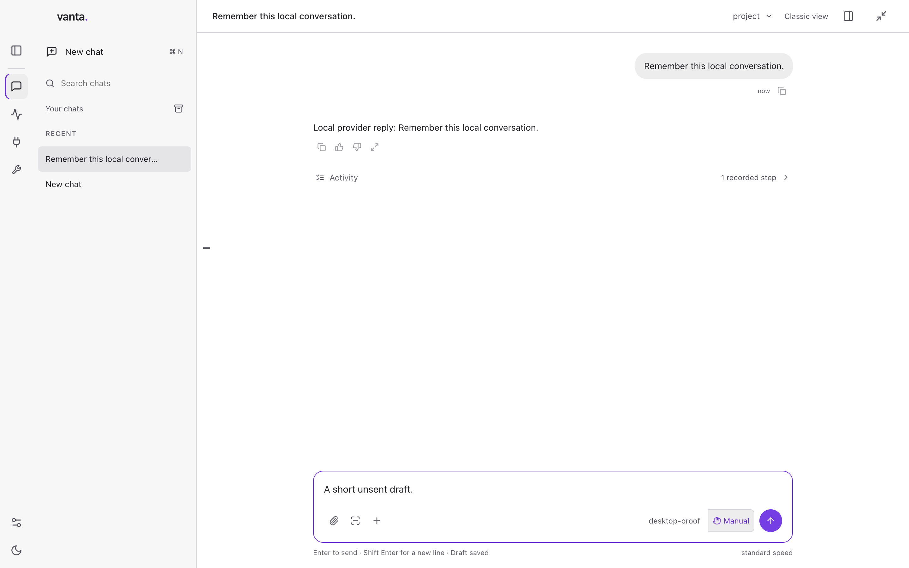

# Desktop spacing and activity — October 3, 2026

## Outcome and scope

Continue the ordinary Vanta Desktop on `codex/librechat-shell-adapter-20261002`.
The owner asked for the actual LibreChat presentation, consistent spacing and a
polished chat workflow. This is not an interview/demo edition, backend migration
or assertion that the whole ambient Desktop card is complete.

The starting source is `9addd16541ff28de1ec43d93f860c800cfb7ce46`. The installed
starting ASAR is `b4c9c7d1965e30b8351106a21b507537528aa1eea48d6c885eac20b7a53cd505`.
Native inspection showed oversized raw tool cards, empty tool-only assistant
messages, double user-bubble padding, misaligned composer/transcript edges, a
fixed tall input with a resize handle, and two simultaneous history previews.
The existing unsent acceptance draft must remain unchanged and must not be sent.

## Source-grounded adaptation

LibreChat was read at `f10b1d91f1eee3a2c82d5247bf620351486b7c1b`, outside Vanta:

- `client/src/components/Chat/Input/ChatForm.tsx`: one-row growing textarea,
  compact controls, shared centered content measure.
- `client/src/components/Conversations/Convo.tsx` and
  `client/src/components/UnifiedSidebar/ExpandedPanel.tsx`: quiet compact history
  and navigation presentation.
- `client/src/components/Chat/Messages/Content/ToolCallGroup.tsx` and related
  `ActivityPhaseGroup.tsx`: disclosure header and inset activity rail.

Vanta keeps its existing runtime, data, sessions, authorization and controls.
The attributed presentation files retain the MIT license, also packaged in the
app. No LibreChat server, credential store, dependency tree or engine is imported.

## Changes

- One 768px measure for transcript, tool activity, approvals and composer; 24px
  outer gutters, reduced to 16px at narrow widths.
- A one-row input grows and shrinks with content, caps at 220px/40vh, then scrolls.
  No manual resize handle; attachment, model, permission and Send/Stop controls
  stay in the same composer. The existing submit handler was extracted unchanged
  to satisfy the size/complexity gate.
- User messages keep one bubble rather than nested background and padding.
- Tool results start as compact neutral summaries with full escaped text on
  demand. Missing and empty results remain distinct. Receiving a payload is not
  presented as proof of success. Structured failure/active activity, approvals
  and recovery remain visible outside the completed fold.
- Tool-only assistant turns no longer render blank messages. Only one history
  preview can appear, selecting a chat dismisses it, and compact metadata remains
  available from keyboard focus and the explicit row menu.

Design principles applied: alignment and shared constraints, Gestalt proximity,
progressive disclosure, native semantic controls, clear focus and low cognitive
load. White/grey and Vanta violet remain unchanged.

## Executed gates

| Gate | Command | Result |
| --- | --- | --- |
| Red packaged layout regression | `node scripts/desktop-chat-first-proof.mjs` against the previous candidate | Exit 1: left alignment drift at 1440px; no installed replacement |
| Renderer tests | `npx vitest run desktop-app/src` | Exit 0; 258 tests / 63 files |
| Full TypeScript suite | `npm test` | Exit 0; 14,503 passed, 3 skipped / 1,595 files |
| Runtime and renderer types | `npm run typecheck`; `npm run desktop:renderer:typecheck` | Exit 0 each |
| Changed production size | `runLint` over the eight explicit changed production TS/TSX files | Exit 0; file ≤300, function ≤50, parameters ≤4, complexity ≤10 |
| Architecture and roadmap | `npx vitest run src/architecture.test.ts src/roadmap` | Exit 0; 180 tests (7 architecture, 173 roadmap) |
| Generated projections | Root `build-order.mjs`, `roadmap-current-projection.mjs --check`, website `gen-roadmap.mjs`; two generator test files | Exit 0; 7 tests, no generated status drift |
| Changed-source security | `semgrep scan --config p/javascript --config p/typescript --metrics=off --error` over eight changed production files | Exit 0; 74 rules, zero findings |
| Repository secrets | `bash scripts/secret-scan` | Exit 0; 2,186 history commits plus tracked/non-ignored snapshot, zero findings |

The first size check exposed the existing Composer function at 51 lines and
complexity 11; extracting its input and submit helpers resolved both without
altering its dispatch contract. A first updater attempt refused the still-running
installed app before replacement. Vanta was then quit through its native menu.
The packaged replay also exposed a test-only race: it captured the temporary
"New chat" title before the saved title refreshed, then reopened the wrong row.
The test now waits for the exact saved title before selecting another chat.
No session-selection production code was changed for that test correction.

An intermediate signed package (`1c48a3c564fd855023bfaa9c08443be26cfa93f5ca3fda6f999b09774619aec2`)
passed 60 checks and was installed with rollback. Native inspection restored the
exact existing draft but exposed inherited global `details` padding/dividers in
the real multi-tool history. A stricter ≤40px collapsed-group check then failed
against that exact package. The final CSS explicitly removes those inherited
styles; this is why passing the earlier ≤80px check was not sufficient polish.

## Installed acceptance

`npm run desktop:rebuild` exited 0 on the final correction: both typechecks,
7 installer tests, production build, Developer ID signing, strict signature
verification, all 60 packaged interactions and guarded app replacement passed.
The replay used 27 synthetic local-provider requests and had zero renderer errors.
It includes the strict ≤40px collapsed tool group, zero inherited top border,
keyboard evidence expansion/collapse, accessibility, 1440px/1024px alignment,
input growth/shrinkage, one preview at a time, drafts, queue, model controls,
approval persistence/failure, Stop, restart, document links, Mini and avatar.

Exact final installed/tested ASAR:
`1eb44d037925e793863ded0eb715cc455a4108805c46779676352d886c96f7af`.
Installed at `2026-10-03T06:56:00.787Z`; receipt:
`/Users/jasonpoindexter/Library/Application Support/Vanta Local Updates/update-j7N3bK/receipt.json`.
The prior bundle is retained alongside that receipt as `Vanta.app`. A separate
SHA-256 read of `/Applications/Vanta.app/Contents/Resources/app.asar` matched.
No operator profile or draft was replaced.

Normal-profile native inspection on the intermediate `1c48a3c5` package restored
the real research conversation and the exact unsent acceptance draft. On the
final `1eb44d03` package, the UI tool reported the Mac locked, so the final native
normal-profile visual check remains pending unlock. The final package screenshots
were inspected at both layout widths and with compact/expanded evidence; those
use disposable fixture data, not a fresh live-provider run. Re-entry: open
`/Applications/Vanta.app`, confirm the unchanged draft, expand/collapse Web fetch
in the existing research conversation, and check the final compact row spacing.

## Boundaries

No protected Rust/factory/MANIFESTO, runtime policy, live-account, operator state,
paid workflow, release, merge, tag or force push is part of this change. Actions
remains disabled. Existing cards retain their status and acceptance requirements.
Still open: the full Connections/background/results/settings/ambient journey,
normal-profile remembered routine approval across tasks/restart, a Vanta-driven
native action, dependency-security integration and deferred unfamiliar-person
acceptance. Those are not cleared by layout or fixture-provider tests.

## Review image

Actual final packaged renderer at 1440px, with disposable local-provider data.
This is not a wireframe or a normal-profile/live-provider screenshot.

