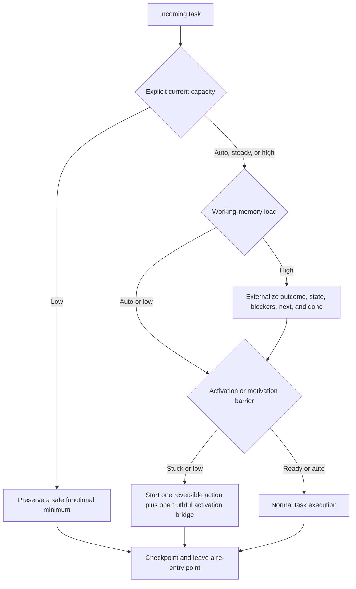

# Capacity-aware executive-function support

Vanta is neurodivergent-first without being diagnosis-gated or person-specific. The operator controls current support state; Vanta does not infer autism, ADHD, burnout, motivation, or capacity from writing style.

## Runtime flow



`auto` means no claim and no special route. Supports modify the task or environment before demanding more effort from the operator.

## Commands

The diagnosis-free entry point is `/support`; `/nd` remains a compatible alias for the full gate profile.

```text
/support
/support capacity low|steady|high|auto
/support load low|high|auto
/support activation ready|stuck|auto
/support motivation engaged|low|auto
/support reset
```

Communication preferences remain available through either command:

```text
/support density minimal|balanced|rich
/support sensory low|medium|high
/support time ranges|points|off
```

The profile persists in `~/.vanta/nd-profile.json`. Older profiles load with all new current-state fields set to `auto`.

## Skill pack

[`executive-function-skills/`](../executive-function-skills/) contains seven independently installable skills:

1. `executive-function-router`
2. `functional-minimums`
3. `task-decomposition`
4. `working-memory-externalizer`
5. `interest-based-initiation`
6. `predictable-low-load-communication`
7. `time-and-transition-support`

`vanta skills install` includes this source alongside the existing design, AI-engineering, security, and bundled skill libraries. Existing local skills still win unless force installation is requested.

## Source synthesis

The implementation paraphrases task-support concepts from:

- Peg Dawson and Richard Guare's executive-skills taxonomy and environment-first interventions
- Judith Kolberg and Kathleen Nadeau's structure, support, strategy, and externalizing systems
- KC Davis's function-first, morally neutral minimums
- Tamara Rosier's energy, activation, and short-experiment framing
- Megan Anna Neff's sensory, interoceptive, burnout, and transition support
- Devon Price's self-trust, masking awareness, and user-defined accommodation
- Oxford's NESTL toolkit for proactive inclusive design and flexible participation

| Source | Extracted product pattern | Encoded in |
| --- | --- | --- |
| *Smart but Scattered* series | Executive-skill taxonomy; change the environment or task; observable goals; review and fade scaffolding | router, decomposition, time/transition |
| *ADD-Friendly Ways to Organize Your Life* | Structure + support + strategy; visible launch points; externalize time and state; match support level to challenge | externalizer, decomposition, router |
| *How to Keep House While Drowning* | Tasks are morally neutral; the user defines function; safety and usefulness precede convention and polish | functional minimums |
| *Your Brain's Not Broken Workbook* | Separate emotional, cognitive, technical, and environmental blockers; compare expected with observed effort; use short experiments | interest-based initiation |
| *Self-Care for Autistic People* | Sensory and interoceptive load; predictable transitions; direct communication; burnout-aware pacing; examples and templates | low-load communication, time/transition, router |
| *Unmasking Autism* | Self-trust, consensual accommodation, no required disclosure, no masking as a success metric | privacy and anti-overreach contract |
| NESTL toolkit | Proactive support without diagnosis; clear expectations; multiple participation modes; advance context; sensory control | low-load communication and universal defaults |

Household-specific routines, child/parent behavior programs, diagnostic scoring, and medical claims were not copied into the runtime. Useful mechanics were generalized only when they preserved operator autonomy and fit Vanta's task domain.

The source books are not redistributed. The supplied `about-me.md` informed universal requirements such as direct language, pattern-first explanation, low-density structure, and current-instruction precedence; none of its personal facts are copied into product seeds, skills, or documentation.

## Privacy and safety contract

- Never infer or store a diagnosis.
- Treat capacity, load, activation, and motivation as current and overridable.
- Do not manufacture urgency, shame, or emotional pressure.
- Preserve consent, verification, data integrity, and irreversible-step checks at every capacity.
- Do not turn a simple request into an intake or coaching ritual.
- Keep personal preferences evidence-based, correctable, and separate from Vanta's public defaults.

## Verification boundary

The TypeScript runtime currently persists and renders the support state through `/support` and the system prompt. Desktop controls and automatic session expiry are separate roadmap work; this document does not claim they already ship.
