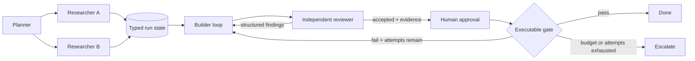

# Graph engineering for Vanta

Updated 2026-07-19.

## Decision

Vanta should not import a general orchestration framework or invent another agent abstraction. It already owns the five nested layers:

| Layer | Vanta today |
| --- | --- |
| Prompt | Three-tier prompt, SOUL, project instructions, and skills |
| Context | Retrieval, memory, compression, file references, and scoped subagent contexts |
| Harness | TypeScript agent runtime around the Rust safety kernel, tools, approvals, retries, budgets, and receipts |
| Loop | Durable loop engine, objective gates, verification, critique reuse, and stop budgets |
| Graph | Declarative agent/approval/interview nodes with next, branch, bounded loop, and parallel transitions |

The product opportunity is to compose the shipped layers into a durable organizational runtime. The graph should encode who acts, what state they may use, how findings move, what evidence permits advancement, and when a human takes over.

## What already works

- `FABRO-WORKFLOW-GRAPH` shipped a versioned declarative graph and kernel-gated runner.
- `WORKFLOWS` shipped common orchestration patterns over delegate and swarm.
- `LOOP-ENGINE`, `LOOP-STATE`, `LOOP-GATES-BUDGETS`, and `LOOP-VERIFY` provide durable loops, budgets, gates, and independent checking.
- `PCLIP-APPROVAL-STAGES` provides named review stages.
- `CRITIQUE-REUSE` carries structured critique into an improvement stage.
- `SCHEMA-TRANSITION-TIMELINE` and Desktop recovery work provide adjacent receipt and replay primitives.

This is enough foundation to avoid adopting LangGraph, CrewAI, or another runtime. Vanta should extend its own typed graph boundary.

## The actual gaps

### 1. Shared run state

The current workflow runner keeps a `Map` of the latest node results and a transcript in memory. Agent nodes receive their own instruction, not a typed view of prior outputs. Parallel work therefore coordinates through prose or external operator effort rather than a durable shared contract.

Target: a versioned run state with declared read/write fields, artifact references, provenance, redaction, atomic transitions, conflict handling, and restart recovery.

### 2. A real review back-edge

Vanta can loop and can require review, but it does not yet guarantee that a reviewer's structured findings become the builder's next input. The edge must carry a finding packet tied to the reviewed artifact and revision.

Target: reject -> record findings -> revise the current artifact -> independently review the new revision -> accept or escalate after a hard attempt cap.

### 3. Evidence-based stop conditions

The current graph runner can match status or an output substring and returns `done` when a loop reaches its iteration cap. Exhausting retries is not success, and model prose is not proof.

Target: typed terminal states (`succeeded`, `failed`, `paused`, `exhausted`, `cancelled`) bound to test results, artifact checks, rubric verdicts, approvals, budgets, and no-progress signals.

### 4. Bounded adaptation

Dynamic organization is useful only under a deterministic policy. The model may propose more research, a smaller topology, a cheaper model class, or human escalation, but it may not grant itself tools, scope, budget, or arbitrary graph mutation.

Target: predeclared node templates, fan-out/depth limits, eligible model classes, confidence thresholds, budgets, and escalation routes. Every topology revision gets a receipt.

### 5. Operator replay and handoff

The operator should not carry the graph in working memory. The UI needs a compact timeline of node status, state diffs, edge decisions, evidence, cost, stop reason, and intervention points. Raw worker transcripts remain isolated unless explicitly opened.

## Target runtime

Each node may run an internal loop. The graph owns cross-node state, routing, budgets, and terminal truth.

## Build order

1. `GRAPH-SHARED-RUN-STATE`
2. `GRAPH-EVIDENCE-STOP-CONTRACTS`
3. `WORKFLOW-COMPOSER-V1` and `WORKFLOW-DATA-HANDOFF-CONTRACTS`
4. `GRAPH-REVIEW-REWORK-CYCLE`
5. `GRAPH-OPERATOR-REPLAY-HANDOFF`
6. `GRAPH-ADAPTIVE-TOPOLOGY-POLICY`
7. `GRAPH-ENGINEERING-V1-RELEASE-GATE`

## Failure modes to design out

- Concurrent nodes overwrite shared fields or make completion order change the result.
- A cycle reaches its cap and is mislabeled successful.
- A reviewer evaluates a stale artifact revision.
- Replay repeats an irreversible side effect.
- Shared state leaks credentials or untrusted prompt content into a privileged node.
- Adaptive fan-out creates runaway cost, deadlock, livelock, or privilege expansion.
- The graph becomes more expensive to maintain than the user work it completes.

The release gate must inject these failures. A static happy-path demo is not sufficient evidence.
