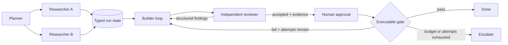

# Graph engineering for Vanta

Updated 2026-07-19.

## Decision

Vanta should not import a general orchestration framework or invent another agent abstraction. It already owns the five nested layers:

| Layer | Vanta today |
| --- | --- |
| Prompt | Three-tier prompt, SOUL, project instructions, and skills |
| Context | Retrieval, memory, compression, file references, and scoped subagent contexts |
| Harness | TypeScript agent runtime around the Rust safety kernel, tools, approvals, retries, budgets, and receipts |
| Loop | Durable loop engine, objective gates, verification, critique reuse, and stop budgets |
| Graph | Declarative agent/approval/interview nodes with next, branch, bounded loop, and parallel transitions |

The product opportunity is to compose the shipped layers into a durable organizational runtime. The graph should encode who acts, what state they may use, how findings move, what evidence permits advancement, and when a human takes over.

## What already works

- `FABRO-WORKFLOW-GRAPH` shipped a versioned declarative graph and kernel-gated runner.
- `WORKFLOWS` shipped common orchestration patterns over delegate and swarm.
- `LOOP-ENGINE`, `LOOP-STATE`, `LOOP-GATES-BUDGETS`, and `LOOP-VERIFY` provide durable loops, budgets, gates, and independent checking.
- `PCLIP-APPROVAL-STAGES` provides named review stages.
- `CRITIQUE-REUSE` carries structured critique into an improvement stage.
- `SCHEMA-TRANSITION-TIMELINE` and Desktop recovery work provide adjacent receipt and replay primitives.
- `GRAPH-SHARED-RUN-STATE` persists versioned graph revisions, node attempts, typed state, artifact references, decisions, budgets, approvals, and mutations under `.vanta/workflow-runs/`. Nodes declare read/write fields; a stable `run_id` resumes confirmed work without replay.
- `GRAPH-EVIDENCE-STOP-CONTRACTS` gives every parsed graph typed terminal, evidence, recovery, cancellation, and budget contracts. Loop caps are exhausted outcomes, not success.
- `WORKFLOW-COMPOSER-V1` adds strict save, reopen, list, diff, and launch operations over immutable project-scoped workflow revisions. Trigger, action, browser, agent, approval, typed-port, side-effect, and bounded-feedback rules validate before execution; launches reuse the kernel-gated workflow runner and durable receipts.
- `WORKFLOW-DATA-HANDOFF-CONTRACTS` maps typed consumer inputs to prior persisted outputs without template interpolation. Static preflight enforces order and type safety; runtime receipts retain provenance and redaction while secret values remain opaque references. This contract is shipped.
- `GRAPH-REVIEW-REWORK-CYCLE` adds independent review nodes and bounded revision edges. Rejection persists a typed packet tied to an exact artifact revision, feeds that packet into the maker's next attempt, rejects stale review evidence, and escalates to a named human gate after the attempt cap.

This is enough foundation to avoid adopting LangGraph, CrewAI, or another runtime. Vanta should extend its own typed graph boundary.

## The actual gaps

### 1. Shared run state — shipped

The current workflow runner keeps a `Map` of the latest node results and a transcript in memory. Agent nodes receive their own instruction, not a typed view of prior outputs. Parallel work therefore coordinates through prose or external operator effort rather than a durable shared contract.

Implemented: graph specs may declare a versioned typed state schema and per-node read/write access. Atomic temp-file replacement and an exclusive run lock protect each project-scoped state file. Disjoint concurrent writes merge; stale writes to the same field fail with a conflict. Secret fields accept opaque `{secretRef}` values only. A stable `run_id` reopens the last committed revision and skips confirmed successful nodes while retrying failed nodes.

### 2. A real review back-edge — shipped

Review nodes declare a separate maker, artifact input, and JSON review output. A revision edge maps that output to a typed maker input and permits only a rejected result to route backward. Every finding carries the rubric item, evidence, affected artifact and revision, severity, and requested change.

Acceptance is valid only when the packet references the artifact revision supplied to the reviewer. Repeated rejection runs the declared human escalation node and terminates as exhausted after the hard attempt cap. Cancellation stops before another node executes, and side effects reached after acceptance still pass through the safety kernel and approval policy.

### 3. Evidence-based stop conditions — shipped

Completion is evaluated over persisted test, artifact, rubric, receipt, node-status, shared-state, and approval evidence. Agent prose is never promoted to evidence. Runs persist succeeded, failed, paused, exhausted, or cancelled terminal receipts with a reason, unmet checks, and recovery action.

Step, wall-clock, token, cost, no-progress, and cancellation budgets halt deterministically. Reopening an exhausted or cancelled run returns the same stop receipt without replaying confirmed work.

### 4. Bounded adaptation

Dynamic organization is useful only under a deterministic policy. The model may propose more research, a smaller topology, a cheaper model class, or human escalation, but it may not grant itself tools, scope, budget, or arbitrary graph mutation.

Target: predeclared node templates, fan-out/depth limits, eligible model classes, confidence thresholds, budgets, and escalation routes. Every topology revision gets a receipt.

### 5. Operator replay and handoff

The operator should not carry the graph in working memory. The UI needs a compact timeline of node status, state diffs, edge decisions, evidence, cost, stop reason, and intervention points. Raw worker transcripts remain isolated unless explicitly opened.

## Target runtime

Each node may run an internal loop. The graph owns cross-node state, routing, budgets, and terminal truth.

## Build order

1. `GRAPH-SHARED-RUN-STATE`
2. `GRAPH-EVIDENCE-STOP-CONTRACTS` — shipped
3. `GRAPH-REVIEW-REWORK-CYCLE` — shipped
4. `WORKFLOW-COMPOSER-V1` and `WORKFLOW-DATA-HANDOFF-CONTRACTS` — shipped
5. `GRAPH-OPERATOR-REPLAY-HANDOFF`
6. `GRAPH-ADAPTIVE-TOPOLOGY-POLICY`
7. `GRAPH-ENGINEERING-V1-RELEASE-GATE`

## Failure modes to design out

- Concurrent nodes overwrite shared fields or make completion order change the result.
- A cycle reaches its cap and is mislabeled successful.
- A reviewer evaluates a stale artifact revision.
- Replay repeats an irreversible side effect.
- Shared state leaks credentials or untrusted prompt content into a privileged node.
- Adaptive fan-out creates runaway cost, deadlock, livelock, or privilege expansion.
- The graph becomes more expensive to maintain than the user work it completes.

The release gate must inject these failures. A static happy-path demo is not sufficient evidence.
