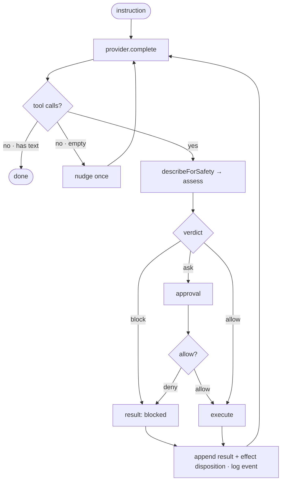

# The agent loop

The agent layer (`vanta-ts/`) orchestrates a model, a tool catalog, and a three-tier prompt. Every action it takes is gated through the kernel.

## The loop

```
messages = [system, user]
each iteration (max VANTA_MAX_ITER):
  trim/compress → provider.complete(messages, toolSchemas)
  no tool calls + non-empty text  → DONE
  no tool calls + empty           → nudge once
  for each tool call → persist pending → dispatchTool:
    describeForSafety(args) → kernel.assess()
      block → tool result "blocked", no execution
      ask   → permission rules / auto-mode may tighten or auto-confirm;
              otherwise prompt; record allow/deny in the kernel
      allow → persist started → execute
    append tool result + effect disposition; log the event
  3 consecutive empty results → stop
```



## Two-layer safety

Safety is enforced twice:

1. **Kernel `assess()`** — keyword + scope classification (the boundary).
2. **Tool self-checks** — path containment, overwrite approval via `ctx.requestApproval`.

`describeForSafety` sends only the risk-relevant part of an action to `assess()` — the path or command, **never file content** — so content keywords can't false-trigger a block.

## Tool results are values, not exceptions

Tools return `{ ok, output }`. The loop never crashes on a tool error — a failure is just a result the model can read and react to. Idempotent reads are retried on transient failure (`VANTA_TOOL_RETRIES`).

### Interrupted side effects

Every tool attempt carries an effect disposition:

- `none` — execution did not start, or the interrupted tool is a known read.
- `confirmed` — tool code returned a result, whether that result was success or failure.
- `unknown` — an effect-capable tool started but was interrupted before returning.

Vanta checkpoints `pending` before dispatch and `started` immediately before tool code. On session restore, a dangling mutating call becomes a synthetic `unknown` result that tells the model to inspect current state before retrying. Unknown plugin and MCP tools are treated as effect-capable. Metadata-only receipts are written to `<project>/.vanta/tool-effects.jsonl`; arguments and outputs are excluded.

## The three-tier prompt

The system prompt is layered so the stable part stays cacheable:

1. **Stable** — identity (the SOUL), the tool catalog, the rules.
2. **Brain / skills** — recalled memory + the skill index.
3. **Volatile** — active goals, paused-carry continuity, current time, recent memory.

## Goal awareness

Before any tool call the agent knows internally which active goal the action serves. A goal carried from a previous session launches **paused** — it won't silently resume until you `/goal resume` or reference it. Set or resume a goal and it becomes the session's working goal (shown in the footer).

## Provider-agnostic

The loop only sees the `LLMProvider` interface (`complete` / `modelId` / `contextWindow`). Swapping OpenAI for a local Ollama model, or routing cheap vs expensive tasks to different models, never touches the loop. See [Providers](./providers.md).
