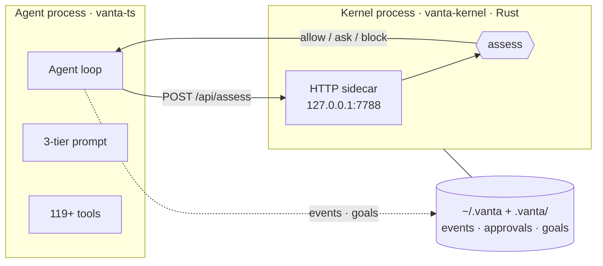

# Architecture overview

Vanta is two cooperating processes: a **Rust kernel** (the boundary) and a **TypeScript agent** (the orchestrator). They talk over a local HTTP sidecar on `127.0.0.1:7788`.



## The kernel (`src/`)

The kernel is the enforced security boundary. It is small, dependency-free Rust, and it owns every decision about whether an action is safe.

| Module | Purpose |
|--------|---------|
| `safety` | `assess_action() → Verdict{ Allow / Ask / Block }` — keyword blocklist, scope check, reversibility pass |
| `approvals` | Persisted approval queue; only `Ask` actions queue |
| `goals` | The goal ledger |
| `runtime` | Safety-gates, then dispatches native actions |
| `server` | Raw TCP HTTP/1.1 — the cockpit UI + JSON API |

**Kernel API** (`127.0.0.1:7788`): `GET /api/status`, `POST /api/assess`, `GET|POST /api/goals`, `GET|POST /api/approvals`, `POST /api/log`, `POST /api/run`.

State lives in `.vanta/`: `events.jsonl`, `approvals.tsv`, `goals.tsv`.

## The agent loop (`vanta-ts/`)

```
messages = [system, user]
each iteration (max VANTA_MAX_ITER):
  provider.complete(messages, toolSchemas)
  no tool calls + text  → DONE
  for each tool call:
    describeForSafety(args) → kernel.assess()
      block → tool result "blocked", no execution
      ask   → approval prompt; the kernel records the decision
      allow → execute
    append tool result; log the event
```

**Safety is two-layer.** The kernel `assess()` gates on keyword + scope. Tools *also* self-check (path scope, overwrite approval). Only the risk-relevant part of an action is sent to `assess()` — the path or command, never file content, so content keywords never false-trigger.

## The three-tier prompt

The system prompt is built in tiers so the stable part stays cacheable:

1. **Stable** — the agent's identity, tool catalog, and rules.
2. **Brain / skills** — recalled memory and the skill index.
3. **Volatile** — active goals, current time, recent memory.

## Extending Vanta

Every subsystem follows a ports-and-adapters shape — you swap an implementation without touching the loop:

- **Add a tool** — drop a `Tool` into `tools/all-tools.ts` (schema + `describeForSafety` + `execute`).
- **Add a provider** — implement `LLMProvider` and add a branch in `providers/index.ts`.
- **Add a search backend** — implement `SearchProvider` in `search/`.

See [the safety model →](./safety-model.md) for how the boundary holds under every one of these.
