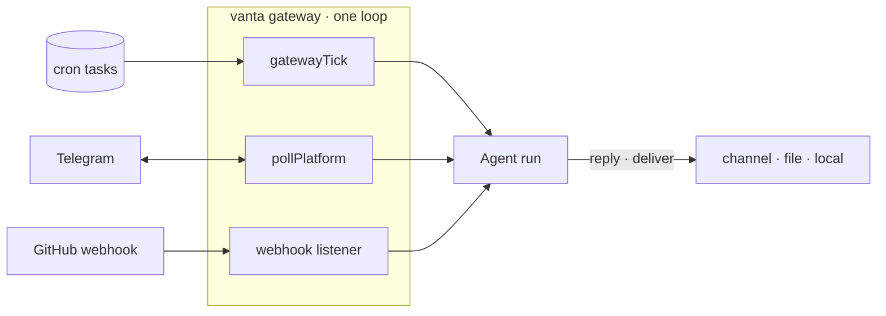

# Comms & gateway

Vanta can read and (with approval) send across email, calendar, drive, and chat — and run as an always-on service you can message.

## Google (Gmail / Calendar / Drive)

One-time OAuth, then per-user tokens stored at `~/.vanta/google-tokens.json` (auto-refresh):

```bash
vanta auth google
```

| Tool | Access |
|------|--------|
| `gmail_search`, `gmail_read` | read |
| `gmail_draft`, `gmail_send` | **always approval-gated** |
| `calendar_read` + `calendar_create`/`calendar_update` | read + gated writes |
| `drive_read` + `drive_create`/`drive_update` | read + gated writes |

Every outbound action (send / draft / create / update) is approval-gated. Provision the OAuth client once (`VANTA_GOOGLE_CLIENT_ID` / `VANTA_GOOGLE_CLIENT_SECRET`).

## Messaging

`vanta setup messaging` runs a registry-driven wizard. **20 messaging adapters are wired** (Telegram, Slack, Discord, Signal, WhatsApp, iMessage, Matrix, LINE, Mattermost, IRC, ntfy, Teams, Twitch, SMS, Zalo, Feishu, WebChat, Nostr, Google Chat, Email) — five are live today (**Telegram · WhatsApp · Signal · Discord · Slack**); the rest are wired and configurable. Telegram, for example, uses a long-poll `getUpdates` + `sendMessage` loop (no SDK) — enable it with `VANTA_TELEGRAM_TOKEN` from @BotFather. The wizard reads the catalog per platform and never writes a fake enable flag for an unconfigured adapter.

The `send_message` tool delivers an outbound message through a configured platform (approval-gated).

## The gateway daemon

```bash
vanta gateway          # cron + message polling + webhook listener, in one loop
vanta service install  # keep the gateway alive via a launchd user agent (macOS)
```

The gateway loop (`gatewayTick` + `pollPlatform` + a webhook listener) runs scheduled tasks, polls messaging platforms (inbound → agent → reply), and serves webhooks. The webhook server verifies GitHub HMAC signatures (constant-time) and routes deliveries (local / file / Telegram). `VANTA_WEBHOOK_PORT` / `_SECRET` / `_PROMPT` / `_DELIVER`.



> Comms tools are offline-unit-tested; live use needs the OAuth client / a bot token.
