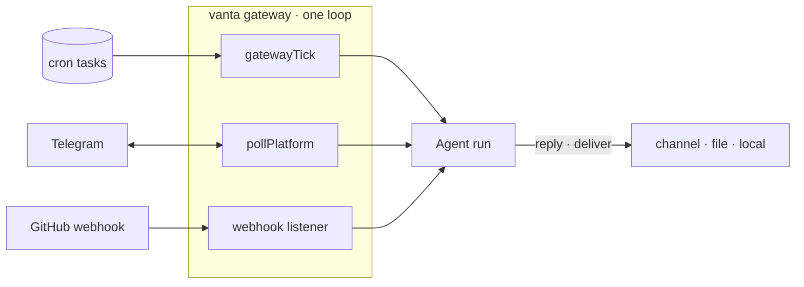

# Comms & gateway

Vanta can read and (with approval) send across email, calendar, drive, and chat — and run as an always-on service you can message.

## Google (Gmail / Calendar / Drive)

One-time OAuth, then per-user tokens stored at `~/.vanta/google-tokens.json` (auto-refresh):

```bash
vanta auth google
```

| Tool | Access |
|------|--------|
| `gmail_search`, `gmail_read` | read |
| `gmail_draft`, `gmail_send` | **always approval-gated** |
| `calendar_read` + `calendar_create`/`calendar_update` | read + gated writes |
| `drive_read` + `drive_create`/`drive_update` | read + gated writes |

Every outbound action (send / draft / create / update) is approval-gated. Provision the OAuth client once (`VANTA_GOOGLE_CLIENT_ID` / `VANTA_GOOGLE_CLIENT_SECRET`).

## Messaging

`vanta setup messaging` runs a registry-driven wizard. Pass a platform id to skip the long catalog, for example `vanta setup messaging telegram`. **22 messaging adapters are registered** (Telegram, Slack, Discord, Signal, WhatsApp, iMessage, Matrix, LINE, Mattermost, IRC, ntfy, Teams, Twitch, SMS, Zalo, Feishu, QQ, WeChat, WebChat, Nostr, Google Chat, Email). Every current catalog entry has a runtime adapter; real delivery still depends on that platform's credentials, webhook, device, or service.

Telegram uses a long-poll `getUpdates` + `sendMessage` loop (no SDK). Its setup flow checks existing state, validates token syntax and calls Bot API `getMe` before persisting, then collects an optional numeric owner allowlist. The prior configuration remains intact when verification fails. In the interactive TUI, `/setup messaging` reports ready, needs-setup, or configured-but-unusable state with one next action.

The `send_message` tool delivers an outbound message through a configured platform (approval-gated).

Allowlisted inbound messages accept the same bounded context syntax as the local composer:
`@file`, `@folder`, `@diff`, `@staged`, `@git:N`, and `@url`. Expansion uses that message's
active project/profile scope and routed model budget before it enters the session queue. The
channel receives a source and warning receipt, and out-of-root, sensitive, binary, or oversized
references are refused. See [Knowledge graph & references](./knowledge-and-refs.md).

## The gateway daemon

```bash
vanta gateway          # cron + message polling + webhook listener, in one loop
vanta gateway status   # finite live/stale/idle readiness; add --json for automation
vanta service install  # keep the gateway alive via a launchd user agent (macOS)
```

The gateway loop (`gatewayTick` + `pollPlatform` + a webhook listener) runs scheduled tasks, polls messaging platforms (inbound → agent → reply), and serves webhooks. The webhook server verifies GitHub HMAC signatures (constant-time) and routes deliveries (local / file / Telegram). `VANTA_WEBHOOK_PORT` / `_SECRET` / `_PROMPT` / `_DELIVER`.



> Comms tools are offline-unit-tested; live use needs the OAuth client / a bot token.
