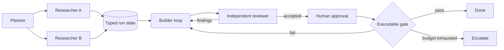

# Graph engineering

Vanta's execution model has five nested layers:

1. **Prompt** — the instruction for one model call.
2. **Context** — project instructions, retrieved evidence, memory, skills, and tool schemas selected for that call.
3. **Harness** — the agent runtime, tools, retries, budgets, receipts, and Rust safety kernel around the model.
4. **Loop** — the mechanism that continues work until an executable gate, budget, or human decision says stop.
5. **Graph** — the organization of multiple agents, tools, loops, and people around shared state and conditional routes.

Vanta already runs declarative workflow graphs with agent, approval, and interview nodes plus branch, bounded-loop, and parallel transitions. Graph engineering is the next product layer: make coordination durable and inspectable instead of asking the operator to carry it between chats.

## The intended contract

The shared state carries typed outputs, artifact references, decisions, budgets, approvals, and provenance. It is not a merged chat transcript. Each node receives only the fields and tools it needs.

## Completion is evidence

A model saying “done” is not a stop condition. Graph completion must come from a declared signal such as:

- a test or validation command passing;
- an artifact satisfying a schema or checksum;
- an independent reviewer accepting the current revision;
- a required human approval;
- a budget, cancellation, or no-progress rule halting the run.

Reaching an attempt limit is **exhausted**, not successful. The run must preserve the unmet condition and a recovery action.

## Adaptive, not unconstrained

A graph may add a scoped researcher when confidence is low, collapse trivial work to one node, route eligible work to a cheaper model class, or escalate to a person. Those changes occur only inside a predeclared policy with hard fan-out, depth, cost, time, tool, and permission limits. Model output cannot expand its own authority.

## Operator control

Every run should expose a compact replay: node attempts, redacted state diffs, selected edges, evidence, costs, approvals, and stop reason. Pause, cancel, safe retry, checkpoint recovery, and human takeover remain available throughout the run.

See the [roadmap](./roadmap) for the ordered implementation slices.
