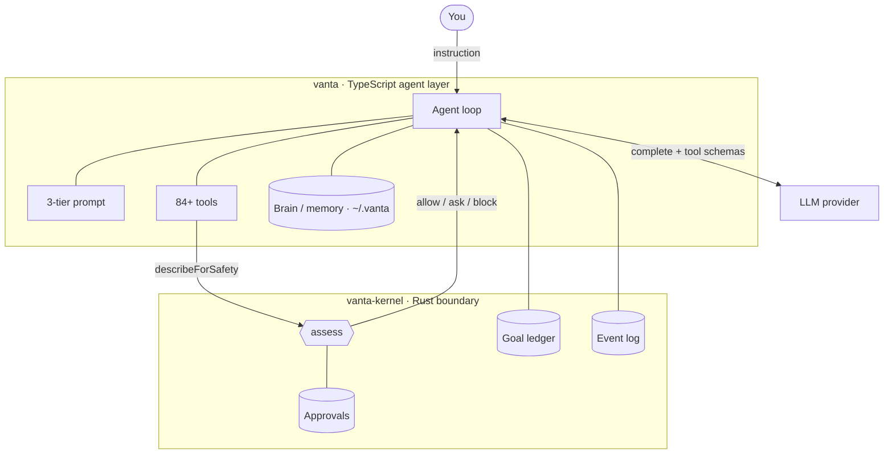
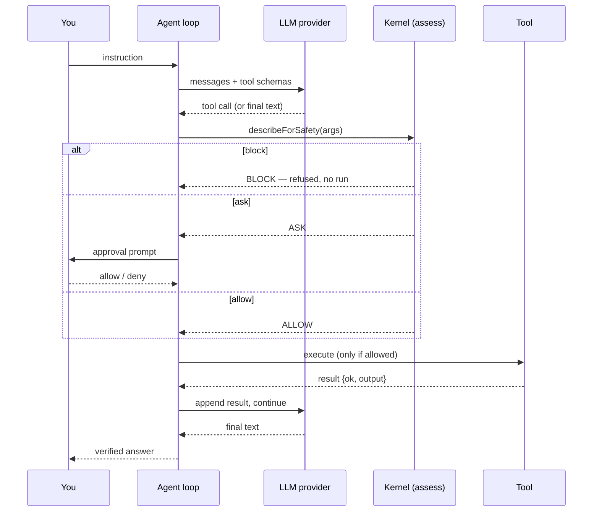
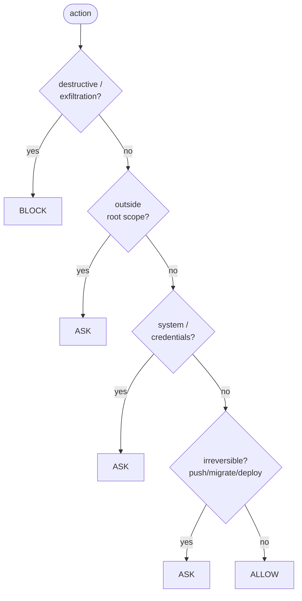
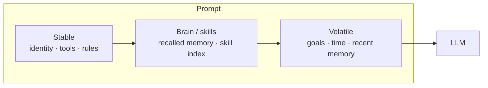
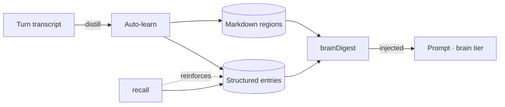

# How it works

Vanta is two cooperating processes — a small **Rust kernel** that decides what's safe, and a **TypeScript agent** that orchestrates the model and tools. The agent cannot act without the kernel's verdict.

## System overview

The kernel exposes a local HTTP sidecar on `127.0.0.1:7788`; the agent calls `assess` before **every** tool execution.

## One turn, step by step

## The safety decision

The classifier runs in a fixed order; earlier floors are never downgraded.

See [Safety model](./safety-model.md) for the tier semantics.

## The three-tier prompt

The stable tier stays cacheable; only the volatile tier changes turn to turn. See [The agent loop](./agent-loop.md).

## Memory & learning

Everything persists to `~/.vanta`, git-versioned for free history. See [Skills & memory](./skills-and-memory.md).
