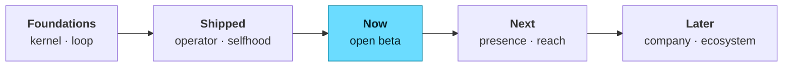

# Roadmap

The full, live backlog — every slice in `roadmap.json`, generated straight from source. A slice is **shipped** only when its done-criterion holds (tests green, behavior verified).

**888 shipped · 9 in build (the open beta) · 136 coming up.**

## Now — in build (the open beta)

These are the rocks in build order on the way to a launchable open beta.

- Setup/install UX
- Messaging adapter — Slack
- Messaging adapter — WhatsApp
- Open-beta gate — live-prove the top operator task paths on a clean machine
- Multi-channel LIVE — 5+ platforms from one gateway (Telegram · WhatsApp · Signal · Discord · Slack)
- Images + voice memos in/out across channels
- Verify + harden SCRIPT-RPC-PIPELINE as first-class zero-context pipelines
- Tool-call repair — auto-fix malformed tool calls (weak/local models)
- Network egress policy — allow/deny for all outbound, not just hooks

## Coming up

### Harness

- Commit attribution — track -modified files for git co-authorship
- `/bg` while responding — active response continues in background, not dropped
- Tree-sitter bash parser — AST-accurate security validation for bash commands
- Self-hosted runner — dedicated entrypoint for running as a CI/CD runner
- Secrets (Bitwarden Secrets Manager)
- Isolated profiles (full VANTA_HOME each)
- Regulator-facing audit export (EU AI Act-aware)
- Harness-thickness future-proofing audit — prune scaffolding as models improve
- Prune the regression suite as tools/schema evolve
- Full-state checkpoints — snapshot + restore/branch a session's complete state
- Live kanban — decompose a goal into lanes + run a subagent swarm
- Prompt-tier strategy port (3-tier assembly)
- SessionStore port (currently fs + fixed JSON path)
- Local logprob scorer via transformers.js — zero-config real pruning
- Multi-dimensional cost attribution (by goal/agent/provider/model)
- Staged review/approval as first-class workflow steps
- Config/agent/skill revisioning with safe rollback
- Enforced outcomes — tasks resolve to a typed result, not a status
- Deep planning — revisionable plan docs with a pre-execution review gate
- Per-run runtime services — dev servers + preview URLs on worktrees
- Outbound media path validation with recency constraint
- Canonical multimodal message-text flattener
- Strip historical media on compaction + shrink-on-413 retry
- Cursor + long-poll reader over jsonl event stores
- No-agent / script cron mode (no-LLM watchdog)
- Self-scheduling skills (cron in skill frontmatter)
- Mount-time warn for shell-interpreter MCP egress
- One-shot-per-job scale-to-zero cron + reconcile
- Skill prereq/env gating + injection-scan on bodies
- Harvest jailbreak signatures as kernel detection inputs
- Serverless LIVE — Modal/Daytona hibernate + wake-on-message, proven
- Batch trajectory generation + compression for training tool-calling models
- Mobile install — Android / Termux path (Vanta in your pocket)
- Native Windows support — CLI / gateway / tools without WSL

### Operator

- TUI v2 — state / safety / working-memory / telemetry rails
- Hooks configuration menu — event/hook/matcher mode selectors
- Teams UI — TeamsDialog, TeamStatus, task assignment messages
- Screenshot to clipboard — copy ANSI terminal output as PNG image
- In-TUI agent editor — edit agent tools, color, model, and file from /agents menu
- Message actions panel — shift+up keybinding to act on previous messages
- Shift-select + clipboard ops in the composer
- Text selection + clipboard in TUI
- Vim operator system — text objects, find motions, counts, dot-repeat, yank register
- WhatsApp adapter (Node subprocess bridge; Business-API alt)
- Memory management UI — file selector + update notifications
- Export dialog — conversation export UI
- Session backgrounding — Ctrl+B to background/foreground running queries
- In-TUI next-prompt suggestions — tappable predicted prompts after each turn
- GitHub integration
- Slack app
- Structured diff renderer — color diff, file list, detail view
- Desktop P12 — native Electron packaging
- Full life/world command center (all dashboards)
- World model of Jason's systems
- Life-wide semantic search
- Ambient context (know what you're looking at)
- Desktop app for Vanta
- Computer-use (cua-driver, desktop control)
- Output style picker UI — in-TUI style switcher
- useShortcutDisplay — render user-configured keybinding hints in UI
- Vim visual mode — `v`/`V` selection with operators in the prompt input
- Markdown table rendering — GFM table support in terminal output
- WorkflowMultiselectDialog — multi-select UI for workflow steps
- Decision classifier — mechanical vs taste vs user-challenge HITL routing
- Messaging adapter — Microsoft Teams
- Fleet digest — steerable summary when agents output more than a human can read
- Cost guard — hard per-run/session budget ceiling that warns/blocks
- Proactive suggestions + session recap
- ND: choice reduction — top-3 ranked + hidden count
- ND: time-blindness supports — ranged estimates + elapsed
- TUI: line-edit keyboard shortcuts (cmd/opt+backspace delete line/word, etc.)
- Factory uses code intelligence — additive, fully optional, no-op if removed
- Delivery-target registry (webhook resolveDeliver switch)
- Display/output formatter port across frontends
- Cmd+Backspace on Terminal.app — known limitation + ^U hint
- Artifacts & work products — first-class agent outputs
- Work queues — continuous routing for repeatable inputs
- Routines that create a tracked issue + wake the agent (catch-up policy)
- Operator activity feed — queryable timeline over events
- Mobile control — review + approve + pause runs from a phone
- Telegram flood-control retry + forum-topic routing
- Inline-keyboard Approve/Deny for kernel approvals (Telegram)
- Mid-turn progress bubble for token-window platforms
- Structural secret redaction + logging formatter
- Setup-wizard field validation + wrong-key detection
- Surface 'compacting now' state in footer
- Web-Audio completion cue (desktop renderer)
- Native OS notification on turn-complete when unfocused
- Per-model reasoning-effort / fast-mode preset memory
- Adversarial-persona UX QA loop (pragmatism-filtered)
- Fail-closed profile-scoped secret resolution
- Provider-reported usage / balance panel (fail-open)
- Verify turn-granular shadow-git rollback coverage
- Live X / social search channel
- OSINT investigation framework (public records)
- Import-from-other-agent onboarding (honest gaps report)
- Pre-exec edit-diff approval + sensitive-path policy
- Wire GlobalSearchDialog open trigger (app.tsx slot + keybinding)
- Wire channel permission relay into the live approval loop
- Dialectic user modeling — a deepening model of who you are (Honcho-style)
- Wake word — hands-free 'Hey Vanta' always-listening trigger
- Ambient presence — macOS menu-bar + mobile companion node
- Visual canvas — a surface the agent draws/builds on (beyond text)
- Proactive outreach — Vanta messages you first on a channel
- User-customizable keybindings — rebuilt on the current TUI

### Extensibility

- Bundles (skill aliases)
- 169 bundled skills (74 + 95 optional)
- Blueprints — reusable project/agent scaffolds you instantiate
- Skills hub — discover/share skills + agentskills.io standard compat
- A2A networked transport behind a Transport interface
- Out-of-process plugin workers + capability-gated host services
- Scoped secret injection — secrets reach only the run that needs them
- Remote/sandboxed agent backends (e2b/cloud-VM) under the kernel
- Adapter capability interface (limits declared, not guessed)
- Sibling-adapter behavior-mixin pattern
- Docker network egress isolation (SEC backlog)
- Vetted MCP catalog + vanta mcp install
- Remote model-catalog manifest with fallback chain
- Declarative config field-descriptor -&gt; generic setup
- normalizeModelForProvider id canonicalizer
- Expose conversations/approvals as an MCP server
- Public API + embeddable SDK — drive Vanta programmatically (versioned contract)

### Solutioning

- Change-watchers for repos/issues/email/calendar
- Mine Goose/Reference for stealable patterns
- Calibrated solutioning — ranged/ensembled recommendations + revisit triggers

### Cofounder engine

- Self-evolve metrics — lift-per-iteration + human-in-loop ratio + spend
- Regression foresight — predict what an evolve edit will BREAK, not just fix
- Interaction-aware evolution — account for non-additive component effects
- Delegation up/down the org chart
- Leadership chat that resolves to real work objects
- Self-organization — agents propose org changes within governance
- Organizational learning — completed work → reusable playbooks
- Export/import an operator workspace (scrubbed bundle)
- Multi-company isolation (one install, many orgs)
- Multiple human supervisors (board users, invites, roles)
- Wire checkDelegated into the live kernel ask-tier approval

## Shipped

<b>Harness</b> — 428 shipped

- Session Memory service — background LLM notes file maintained during conversation
- Streaming tool execution — start tools as tool_use blocks arrive in stream
- `MessageDisplay` hook event — transform or hide assistant messages before rendering
- Hooks engine — shell commands on agent events
- `/goal` — set a completion condition; agent works until it's met
- Hook `additionalContext` — hooks return context to keep the turn going
- Teams tool — named multi-agent squads
- Background agent management — agents view, attach, logs, respawn, daemon
- Auto permission mode — ML action classification + soft-deny preset
- --json-schema — structured output + JSON Schema validation
- Hook matcher depth — all conditional hook matchers
- API key helper script — dynamic API key via shell command or project settings
- Checkpoint + rewind code & conversation
- AST code compressor (keep signatures, drop bodies)
- Send message tool — agent-to-agent messaging
- /hooks — manage shell hooks from the REPL
- /pr-comments — view and resolve GitHub PR comments
- Effort levels — --effort flag, effortLevel setting, extended thinking controls
- Path-scoped rules system — .vanta/rules/ with YAML frontmatter + globs
- Accept Edits permission mode — auto-approve filesystem ops without prompt
- Team memory secret scanner — block file edits that introduce secrets to team memory
- LSP async diagnostic push — publishDiagnostics notifications as conversation attachments
- StructuredOutput tool — schema-validated JSON output for SDK/non-interactive sessions
- Durable cron jobs — persist scheduled tasks across session restarts
- Agent hook type — hooks backed by a full multi-turn LLM agent
- Post-compact file restoration — re-inject top files and skills after compaction
- History snipping — automatic SDK conversation pruning for long-running sessions
- Verification agent — built-in agent that auto-verifies task completion
- Reactive compact — proactive compaction triggered by context analysis warnings
- `/init` command — generate a CLAUDE.md project context file
- Token count API — pre-compute context size before API call (/Bedrock/Vertex)
- `/bg` flag preservation — backgrounded sessions keep all startup flags
- Hook MCP tool invocation — `type: 'mcp_tool'` in hook config calls MCP tools directly
- Advisor escalation — read-only stronger model after repeated failure
- Hook type — http, mcp_tool, prompt, agent hook types
- Extended hook event coverage — all 30 hook events
- --max-budget-usd — per-session spend cap
- --fork-session — create a new session ID on resume
- vanta project purge — delete local project state
- --safe-mode + --bare — troubleshooting isolation modes
- --init / --init-only / --maintenance — lifecycle hook flags
- Git settings — attribution, PR template, gitignore
- CLAUDE.md / VANTA.md @-import syntax — include external files by reference
- --from-pr — resume sessions linked to a specific pull request
- Session cleanup period — cleanupPeriodDays setting
- skipWebFetchPreflight — bypass web fetch domain safety check
- /tasks slash command — list and manage background tasks from the REPL
- /describe slash command — generate file and directory descriptions
- /stop slash command — gracefully stop the current agent turn
- PR status polling — live review state during session
- /loop — recurring cron task from natural-language interval
- macOS caffeinate — prevent system sleep during long operations
- ConfigTool — agent reads and updates user settings during session
- ToolSearchTool — on-demand deferred tool loading by keyword
- 1M context upgrade prompt — suggest extended-context model when approaching limit
- macOS Keychain credential storage — secure OAuth token persistence
- Dangerous bash patterns — strip interpreter allow-rules at auto-mode entry
- Conversation history with large-paste external storage
- Agent scratchpad directory — gated workspace for temporary files
- SSRF guard for HTTP hooks — block private/cloud-metadata IPs
- FileChanged + CwdChanged hook events — file watcher triggers
- Teammate default model — Opus 4.6 for swarm agents, provider-aware
- /security-review — built-in security audit of current branch changes
- Cyber risk instruction — system prompt section for security task safety
- Shell output size limits — 30K default, 150K cap, BASH_MAX_OUTPUT_LENGTH override
- Settings live reload — detect and apply settings changes without restart
- Cross-project session resume — resume sessions from different projects
- Concurrent session management — track multiple running instances
- Prompt hook type — hooks backed by a single LLM query
- Frontmatter hooks — agents and skills declare hooks in YAML frontmatter
- Once-only hooks — `once: true` hooks auto-deregister after first fire
- Hook exit code semantics — exit 0 silent, exit 2 blocks + shows model, other shows user
- CLI auto-updater — version notification + background update with semver comparison
- Deferred SessionStart hooks — async hook execution without blocking REPL startup
- Memory usage monitor — high/critical heap warnings at 1.5GB / 2.5GB
- Token budget directives — parse +500k / use 2M tokens from user messages
- Parallel tool execution — concurrent read-only tool calls with configurable cap
- VCR record/replay — record API request/response cassettes for test replay
- API preconnect — pre-warm TCP+TLS during startup for 100-200ms first-request savings
- Adaptive thinking mode — let model self-budget tokens + `ultrathink` max-budget keyword
- Hook timing indicator — show elapsed time when hooks take &gt;500ms
- Undercover mode — safety strip for public/open-source repo contributions
- /env — set session-scoped environment variables for child processes
- Privacy levels — default/no-telemetry/essential-traffic to control network traffic
- Interleaved thinking — thinking tokens between tool calls, not just before response
- Model tier env overrides — pin opus/sonnet/haiku to specific model versions
- Shadowed permission rule detection — warn about unreachable allow/deny rules
- Auto tool-search mode — defer tools only when they exceed the context threshold
- `--bare` mode — minimal output format for scripting and pipelines
- Prompt cache break detection — detect invalidation, trigger microcompact cleanup
- --dump-system-prompt — CLI flag to print the assembled system prompt and exit
- `/cd` — change working directory mid-session without breaking prompt cache
- `PermissionDenied` hook — fire on auto-mode classifier denials with retry option
- Hook exec form — `args: string[]` spawns hook directly without a shell
- Hook `continueOnBlock` — feed PostToolUse rejection reason back to model
- `sandbox.network.deniedDomains` — block specific domains under a broader allowlist
- Ultracode trigger keyword — `ultracode` in prompt launches dynamic workflow
- Hook `sessionTitle` output — `UserPromptSubmit` hooks can set the session title
- `/less-permission-prompts` — scan transcript and propose read-only allow rules
- Shell startup file write prompt — confirm before writing `.zshenv`, `.bash_login`, etc.
- `/proactive` alias for `/loop` — proactive autonomy mode discoverability
- `.husky` in acceptEdits protected dirs — git hooks directory is write-protected
- Monitor tool — reactive line-by-line command monitoring
- --exec — run a shell command as a background job alongside the session
- --exclude-dynamic-system-prompt-sections — prompt cache optimization
- Memory settings — autoMemory, excludes, plans dir
- Organize-code tool — agent-callable file decomposition
- Swarm permission routing — workers forward permission asks to lead agent
- Team memory directory — shared memory namespace for swarm agents
- Magic Docs — auto-maintained markdown files updated after each turn
- Coordinator mode — env-controlled lead-agent persona with restricted tool set
- LSPTool full — call hierarchy, find references, hover, document symbols
- Task management tools — TaskCreate/Get/List/Update/Stop/Output for agent loops
- Shell snapshot — capture aliases, functions, PATH for shell completions
- Built-in agent types — Explore, Plan, Verification, Guide, General Purpose
- Per-agent-type memory — scoped memory dirs per agent (user/project/local)
- In-process swarm backend — agents share Node.js process via AsyncLocalStorage
- Read-only command validation maps — git/gh/shell safe-flag allowlists
- Bash security blocks — process substitution, Zsh expansions, heredoc injection
- Fork subagent — implicit context inheritance when subagent_type omitted
- MonitorMcpTask — background MCP monitoring task (MONITOR_TOOL gate)
- Swarm idle notification — teammate sends idle state to leader on Stop
- LocalWorkflowTask — workflow script task type (WORKFLOW_SCRIPTS gate)
- Git worktree tool — isolated branch workspaces
- Bash auto-classifier — ML-based auto-approval for safe bash commands
- /batch — parallel multi-agent code implementation skill
- Fix nondeterministic full-suite test flakes (watcher + Ink UI) + reconcile stale doc counts
- Tmux swarm backend — spawn agents in tmux panes with locking + color coding
- Plan mode v2 — multi-agent plan execution (Max=3 agents, enterprise=3)
- Session memory compact — compact into persistent session memory files (not just summary)
- UDS peer agents — `/peers` command and ListPeersTool for agent discovery via Unix sockets
- Templates — prompt classification and template injection for common task patterns
- Vision routes to a dedicated model
- Trust calibration: verified / inferred / uncertain / needs-check
- Built-in code-size gate (industry-standard, always on)
- Verification must prove the actual claim (not a proxy)
- Strip /Claude/agent mentions from published code
- Clean industry-standard plugin/capability install (no repo pollution)
- Messaging setup wizard (Telegram/iMessage/WhatsApp/Signal)
- Automatic per-task model routing + ephemeral subagents
- `ENABLE_PROMPT_CACHING_1H` — opt into 1-hour prompt cache TTL
- In-session permission rules (allow/ask/deny)
- OS sandbox for tool execution
- Auto-compact — automatic context compaction when window fills to threshold
- Emergent self-designed brain
- Dynamic workflows (agent writes its own orchestration harness)
- Safe kernel self-repair (propose→prove→swap)
- Pre-send self-evaluation rubric
- Code-based DM pairing (consent over allowlists)
- Per-model capability matrix
- Stall recovery / bounded-retry
- Diagnostic repro bundle
- Personal model scorecard
- Anti-slop filter (detect + flag AI-ish drift)
- Plugin lifecycle hooks (pre/post tool + LLM + session)
- Checkpoints + /rollback
- Model escalation + per-cycle cost ledger
- vanta update — safe self-updater with rollback
- Provider fallback chain on failure
- vanta security audit — dependency/supply-chain scan
- Local OpenAI-compatible proxy over OAuth providers
- Long-run resilience — resume an unattended run after a mid-flight drop
- Pay down the 85 size-gate violations CODE-SIZE-GATE surfaced
- Enforced read-only plan mode
- Background shell tasks
- Layered settings.json
- Multi-directory roots (/add-dir)
- Print/headless mode + output formats
- Remote MCP servers (HTTP + OAuth)
- Deferred MCP tool schemas
- Skill frontmatter
- Worktree-isolated subagents
- Native context compression (Headroom concept, zero-dep)
- Diagnostic baseline tracking — surface only new LSP errors after file edits
- Per-function aux-task model map
- Reflection + learning from correction (extract the rule)
- Protection agent (scams, privacy, unsafe actions, agent overreach)
- Born-small codegen (registry-by-default + 300 gate)
- Intent-satisfaction LLM-judge gate
- Ambiguity-gated preflight (unifies with ND clarify)
- Auto-spec + fan-out a roadmap card into child tasks
- Holdout author-separation validation
- Frictionless this-broke recorder
- Agent-native add-card tool
- Early fail-detect + safe retry + honest report
- Action previews + post-action proof
- Visible cost + latency per call (local vs frontier)
- Working docs site (renders every doc)
- Work-item closure loop
- Stable prompt prefix for LLM cache hit rate
- Setup wizard (setup)
- Doctor / status
- Provider auth (pooled creds, login/logout)
- Config show/edit/migrate
- Providers (models.dev catalog, 109+)
- Task routing (cheap/expensive)
- Aux-task model (vision/summarize)
- Gateway daemon (run/start/stop/install)
- 21 platforms (discord/slack/whatsapp/signal/imessage/email/matrix/…)
- Webhook subscriptions (webhook)
- Interactive chat / oneshot
- Toolsets (30 keys, per-platform config)
- LSP (status/list/install)
- Cron / scheduled jobs
- Skill search/install/manage (skills)
- Skill index in prompt + body on demand
- Sessions save/resume/rename/export/prune
- External memory provider
- Checkpoints (fs store)
- Kanban board (SQLite, cross-profile)
- Swarm (root→workers→verifier graph)
- Diagnostics (distress signals)
- Goals
- Action safety gating
- Approval before risk
- MCP client (use servers)
- MCP server (serve Vanta, gated)
- MCP catalog / picker
- Voice loop (whisper + TTS)
- Vision / image / video tools
- Logs / debug
- Relaunch / service manager
- Desktop app (Electron)
- Gmail / Calendar / Drive (via skills)
- Accept-edits mode + full approval cycle
- Side question without history (/btw)
- Exact token/cost from provider usage
- Path-scoped rule files
- Queued input while busy (shipped)
- Manual compaction (shipped)
- MCP servers (shipped)
- Cost/usage tracking (shipped)
- Subagents (shipped)
- Scheduled / loop agents (shipped)
- Layered memory (shipped)
- Git tools (shipped)
- Model picker + switch (shipped)
- Doctor / status (shipped)
- Run code sandboxed (shipped)
- LSP code intelligence (shipped)
- Surface compression savings in the cost footer
- agent.ts size paydown (309 &gt; 300 after COMPRESS-NATIVE)
- Glob tool — file pattern search
- Grep tool — fast code search
- Targeted file edit — old/new string replacement
- Sleep tool — pause execution
- /permissions — manage tool allow/block rules
- /files — list files in current context
- /branch — create or switch git branches from REPL
- /summary — summarize the current conversation
- Brief tool — proactive user notifications with attachments
- Memory freshness caveat — staleness annotation for memories &gt; 1 day old
- Shell task stall detection — notification when background command awaits input
- Tool batch summary — Haiku-generated ~30-char label for completed tool batches
- Time-based microcompact — auto-clear stale tool results after cache TTL expiry
- /rename — set session title
- Fix: image drag-drop from Desktop fails ENOENT (path not in scope)
- Destructive bash command warnings — informational notes in permission dialog
- /context — show context window usage breakdown with microcompact option
- Bash per-command exit code semantics — grep exit 1 = no-match, not error
- NVIDIA NIM provider — cheap worker routing for summarize/classify/code
- Model deprecation warnings — show retirement date when user is on a deprecated model
- Auth conflict notice — warn when both API key and OAuth credentials are configured
- /compact with custom instructions — control what the summary preserves
- Dangerous paths blocklist — hardcoded files/dirs Claude never writes to
- Compaction reminders — inject compaction_reminder attachment into context
- Prefer-local routing
- Recovery / degraded CLI
- vanta model — CLI provider/model pulldown
- Port bundled coding skills
- Gemini provider
- OpenRouter provider
- First-run detection
- vanta status / doctor
- Claude subscription provider
- ChatGPT- OAuth
- Post-turn nudge counters
- Interactive product roadmap
- Secret-hygiene hardening
- One-line curl install
- vanta setup wizard
- Background-review fork
- Skill provenance + safe curator
- Autonomy ladder (L1–L4, kernel-bounded)
- Autonomy L5 (auto-merge low-risk)
- Compartmentalized self-repair (body model)
- Session persist + resume
- Slash-command
- Dark factory (self-improving codebase)
- Turn-abort hardening — transcripts self-heal, kernel-down fails closed gracefully
- Loop engine — first-class loops: trigger + stages + rubric + stop rules
- Loop state — durable per-loop memory across wakes
- Loop gates + budgets — objective advance gates, kill switches, accepted-rate ledger
- Native verification primitives — adversarial fan-out, tournament, generate-filter
- Scoped wakes — wake reason + delta context instead of full history
- Goal dependency graph — blocked_by/blocks + auto-start scheduler
- Kernel liveness watchdog — every loop/goal in a named state, stalls surfaced
- Rubric engine — weighted per-category rubrics with confidence-weighted scoring
- Group-relative evaluation — advantage over the batch mean, not absolute thresholds
- Critique-reuse improve stage — judge reasoning feeds the next generation
- Process supervision — verify intermediate stages, not just final output
- Cockpit loop panel — live loops + escalations in the kernel dashboard
- Cockpit redesign — self-explaining boundary dashboard
- Full-feature demo (the CLI grammar) — TUI north-star + feature tracker
- Claude-style approval menu — numbered, arrow-selectable, with always-allow
- Rounded-border input box (Claude shape) replacing bare ─ rules
- Truecolor hex default theme matching the design reference
- Anti-ghosting: commit streamed text before a tool call
- Clean responses — drop the Goal/Expected preamble + per-turn token dump
- Main-session chrome — active-goal line · compact PLAN bar · status chips
- Rich /goals ledger view — active/done + plan + working memory
- Styled /sessions + /model pickers (vs plain list overlays)
- Render tool calls as ⏺ Tool(args) / ⎿ result (Claude grammar)
- Blinking composer cursor — the alive/ready idle cue
- Shift+Tab autonomy mode cycle — normal / auto-accept / plan (Claude)
- Loops dashboard — live loops + escalations (TUI)
- Dive-into-the CLI — design-space reference
- Self-audit Vanta against the 13 design principles
- Reversibility-weighted risk in the kernel — lighter gate for reversible actions
- Experiential memory tier — an evolving cross-session playbook
- Generator-evaluator separation + tool-call trace anomaly detection
- Five-layer graduated compaction pipeline
- Deferred tool schemas — names first, full schema on demand
- Optional ML auto-mode classifier as an advisory tighten-only stage
- Optional shell sandbox — restrict fs/network for approved commands
- Subagent sidechain transcripts + summary-only return
- Focus-aware proactive heartbeat (KAIROS) with economic throttling
- Long-term human-capability preservation as a first-class surface
- Map the hook engine against the 27 event types
- Anatomy-of-an-Agent-Harness — practitioner reference
- Ralph Loop — two-phase long-running pattern with filesystem continuity
- Memory-level guardrails — freshness / conflict / provenance before acting
- Observation masking — hide stale tool outputs, keep the tool calls
- Per-task tool scoping — expose the minimum tool set per step
- Visual + computational verification loop (verify improves quality 2-3x)
- Self-correcting-harness — reference
- Self-correction loop — failure to diagnosed fix to regression-locked
- Failing run to regression test — the trace-as-asset principle
- Plain-English assertion suite (LLM-as-judge), not numeric metrics
- Human only at diff approval — automate the low-signal loops
- Capture the active config per trace for reproducible reruns
- Agent sandbox — test a config change end-to-end without touching git
- Keyless web search is standard — Bing + Jina-over-DDG fallbacks
- UI-TARS-desktop — desktop-operator reference
- Desktop action schema — click/type/scroll/observe primitives
- Vision-to-action loop — screenshot → grounded, safe action
- Local desktop control within the kernel boundary (no feral agent)
- Ultrathink — extended-reasoning / thinking-budget mode
- Ultracode — multi-agent coding orchestration
- Deep-research harness — fan-out search, verify, synthesize
- Vanta wanted-abilities wishlist — capability north-star
- Reach capability layer — channels with probed backends + doctor
- Per-channel reach doctor — active backend + exact fix
- RSS/Atom channel — subscribe + read feeds
- Reddit channel — search + read posts/comments
- Twitter/X channel — native GraphQL (no Python), search + bookmarks, self-healing query IDs
- LinkedIn channel — profiles/companies/posts via authenticated browser session
- Cookie import flow — browser-exported cookie → channel auth
- YouTube channel — video info + subtitles via yt-dlp
- GitHub channel — repos, issues, PRs, READMEs via gh CLI
- Podcast channel — episode audio → transcript (Groq Whisper)
- Self-healing reach backends — rebuild when the platform changes
- Auto-minimalism mode — /auto command + skill (do the least that works)
- Authenticated browser read — browser_read + browser-session primitive (any login-walled/JS page)
- Zero-paste cookie import — auto-read the live browser cookie store
- Eval harness — task set + sandboxed run + reward/verifier signal
- Trace distiller — events.jsonl to sourced root-cause report (Agent Debugger analog)
- Eval corpus — small curated task set with deterministic checks
- Eval sandbox runner — isolated per-task execution
- Eval verifier — per-task reward/score signal
- `vanta eval` — run the corpus, record a baseline score
- Kernel: remove the hardcoded Jason path from the scope check
- Kernel: canonicalize paths + resolve symlinks in scope checks
- Kernel: tamper-evident audit log (hash-chained events.jsonl)
- Kernel: cut assess denylist false positives (verb+target parse)
- Kernel: robust write-path extraction for the protected-path check
- Async background delegation — handle in ~2ms, result re-enters as a new turn
- Architectural fitness function — boundary rules as a CI-failing test
- Authoring skill — new Vanta capability = port + adapter
- Pre-commit hook runs the boundary check
- Brain port — route the 3 brain variants behind one interface
- KernelClient interface over SafetyClient (~25 sites)
- ToolRegistry interface (currently a concrete class)
- MemoryStore port — replace resolveVantaHome fs coupling (~61 sites)
- Resolve dormant brain variants (v2 + brain5d) under the new port
- Memory-recall eval harness — measure lexical vs semantic vs hybrid over noisy multi-session corpora
- Tool-output delivery strategy — inline default, file-pointer for large results (backbone-gated)
- TOON dictionary/columnar encoding — push lossless tabular past 60%
- Cost-Normalized-Gain metric for the compression bench (from S2L)
- Byte-compress the CCR stash on disk (gzip), transparent on retrieve
- Wire a real LM scorer into pruneText (LLMLingua / Kompress-base)
- Wire TOON dictionary mode into Vanta tool-output (opt-in)
- Real LM-logprob scorer for pruneText (genuine LLMLingua-grade)
- Skill-sensitive eval corpus — tasks where the right skill lifts pass@1
- vanta eval compress &lt;dim&gt; — repeatable control/treatment CNG measurement
- Apply pruneText (real scorer) to an opt-in context path — measurable + usable
- Run the live CNG measurement, record results, flip defaults only where CNG&gt;=0
- Resolve the pruning scorer (aux-task ladder), heuristic fallback
- Gateway session manager — interrupt / steer / queue inbound messages (from )
- Compact + retry on a context-length error (from )
- Benchmark the brain on real LongMemEval + LoCoMo (the solid memory number)
- Parallel agent fleet — fan out N independent tasks + a review surface
- Auto-research loop — objective + verifiable metric + bounds, runs unattended
- Meta-tune the agent's own instructions against an eval (program.md optimization)
- Per-function aux model map (speciation) — small specialized models per task
- Verified contribution pool (untrusted workers) — design spike
- provider model selection — verify + document which model to use
- Declarative workflow graph — diffable agent pipelines with human-gate nodes
- Selector-based model stylesheet — per-class model+effort routing with fallback chains
- Recover — failure-mode triage (bug vs polluted-context vs wrong-assumption)
- Current-docs-before-use — fetch up-to-date library docs before coding against a lib
- Path-grouped lossless densification of grep/search tool output
- CCR disposition — keep / scope-to-history / retire, from the measurement
- Currency/recency rule in the system prompt — verify-before-stating, no cutoff hedging
- Script injection + tools-via-RPC — zero-context-cost pipelines
- Atomic task checkout + execution locks (no double-work)
- Scoped budget hard-stops — overspend auto-pauses + cancels queued
- Heartbeat run pipeline — coalesced queue, secret/skill injection, orphan recovery
- Maximizer mode — higher-autonomy execution under hard governance
- Structured argv assessment + default-on sandbox for shell_cmd
- Per-install bearer token on kernel /api/* (local multi-user defense)
- Pin the winnow git dependency to a commit SHA
- Categorized provider-error taxonomy -&gt; typed recovery hints
- Compaction tool-pair boundary alignment + anti-thrash
- Informative per-tool prune summaries
- Cron at-most-once: pre-advance + per-fire dedup
- Wire anti-thrash gate into per-turn compaction (recentSavings)
- Enforce settings.blockedTools at registry build (buildRegistry exclude)

<b>Operator</b> — 379 shipped

- Interactive edit-review panel — per-change keep/undo with keyboard nav
- TUI design language — lipgloss-grade layout primitives (tabs, dialogs, panels, status chips)
- TUI v2 — mission-control surface (non-destructive)
- Tab navigation — focus management between UI elements
- Desktop P3 — real React/Vite renderer
- Per-tool permission request UIs — dedicated dialogs per tool type
- Unified @-completion typeahead — files, MCP resources, agents, slash, Slack, shell history
- ToolUseLoader — dedicated loading animation per tool call
- `/tui` — toggle fullscreen flicker-free rendering mode in the same session
- `/focus` command — separate focus view toggle (split from Ctrl+O)
- Line-based virtual scrolling — viewport slices by rendered lines, not entries
- Scroll up while agent is streaming (normal mode)
- Syntax-highlighted code blocks — HighlightedCode with language detection
- TrustDialog — project trust + MCP server trust confirmation
- Sub-agent progress summaries — periodic 3-5 word status in footer pill
- TUI image paste + clickable links and file paths
- Vim mode — vi keybindings in the composer
- Rich status line — rate limits, lines diff, session name, worktree
- Teammate spinner tree — parallel agent visualization
- Context visualization — per-category breakdown + autocompact buffer + suggestions
- Sandbox settings UI — config, dependencies, doctor, overrides tabs
- MCP management panel — list, tool detail, reconnect, elicitation
- QuickOpenDialog — Ctrl+P fuzzy open for files, sessions, commands
- Task management panel — TaskListV2, background task dialogs
- Agent management UI — AgentDetail, AgentEditor, AgentsList, AgentsMenu
- Bash image output — base64 data URI in stdout renders as inline image
- AI-powered permission explanation — risk level + reasoning for tool calls
- Shell tab-completion in bash input — command, variable, and file suggestions
- /stats — usage statistics and activity dashboard in-session
- AskUserQuestion tool — structured multi-question UI with options, previews, multi-select
- Asciicast session recording — record sessions as terminal replay files
- PDF reading — extract text from PDFs as context with size/error handling
- Agent memory snapshot — update dialog after custom agent sessions
- Settings panel UI — Config, Status, Usage tabs
- Bounded agent-role council (CEO/CTO/COO/.../Reflection)
- Stalled spinner animation — visual state change when agent is stuck
- Glimmer / shimmer text animation during processing
- Hook progress message — live hook execution in transcript
- Message timestamps — per-message time display
- Shell command timing — elapsed time display per command
- Channel message display — incoming platform messages in transcript
- Effort indicator — visual effort level callout in TUI
- BypassPermissions confirmation dialog — explicit gate for dangerous mode
- Cost threshold dialog — alert when approaching budget cap
- Terminal window title — session name / active task in title bar
- Status notices — notices area above the status line
- ThinkingToggle — dedicated expand/collapse control for reasoning
- SkillsMenu — in-TUI skill browser and picker
- Advisor message — stronger-model reviewer response in transcript
- ShutdownMessage — graceful session end display
- Auto mode opt-in dialog — confirmation flow for ML permission mode
- KeybindingWarnings — conflict detection and resolution hints
- Resource update message — MCP resource change in transcript
- Custom output styles via .claude/output-styles/ — markdown-file-defined styles
- /copy — copy last response as markdown, HTML, or RTF to clipboard
- Project onboarding wizard — first-run step-by-step setup for new workspaces
- TodoItem activeForm field — track current action verb in todo items
- Teammate color coding — unique color per agent in swarm UI
- MCP server reconnect + enable/disable toggle in live session
- Custom spinner verbs — user-configurable loading message verbs
- /terminal-setup — install Shift+Enter keybinding for terminal newlines
- Away summary — auto-generate context recap when terminal regains focus after 5+ min
- OS system notification — desktop alert after long tool runs when terminal is inactive
- Copy-on-select — auto-copy terminal text selection to clipboard (iTerm2-style)
- Clipboard image hint — notification on focus when clipboard has an image
- AI session title — auto-generate session name via Haiku from conversation content
- In-session transcript search — full-text search across conversation messages
- Standalone agent name/color — custom identity for non-swarm agent sessions
- Auto-mode denial history — /permissions tab showing recently blocked commands
- Chrome automation GIF recorder — capture multi-step browser interactions as GIF
- Smart first-run example commands — git-history-aware prompt suggestions on empty input
- Auto-run /issue — proactive GitHub issue creation with ESC cancellation window
- External prompt editor — open $EDITOR to compose multi-line input
- Shell output JSON auto-format — pretty-print JSON lines in bash output
- Terminal hyperlinks — OSC 8 clickable links in tool output and messages
- /stats sparkline charts — ASCII activity charts and heatmap in stats view
- History picker — searchable input history overlay in the prompt bar
- MCP rich output — enhanced rendering for large MCP tool results
- Idle return dialog — re-engagement prompt after session inactivity
- Sandbox violation expanded view — detailed breakdown of blocked sandbox actions
- MCP server multiselect dialog — batch-enable project MCP servers
- MCP project server approval — per-project approval dialog for .mcp.json servers
- Shell history ghost text — inline completion from zsh/bash history in prompt input
- File path completion — tab-autocomplete for directory and file paths in prompt
- `/usage` — merged `/cost` and `/stats` into tabbed view
- Status line GitHub PR info — repo and PR data in status line JSON input
- `Ctrl+U` clears entire input; `Ctrl+Y` restores — readline kill-buffer update
- Display/UX settings — spinner tips, turn duration, away recap, etc.
- Plan approval message — rendered plan + approve/reject in transcript
- Message selector — select and copy transcript messages
- Distinct bash input/output message types
- Session preview — visual session content preview in resume picker
- SearchBox — in-transcript search with highlight and navigation
- Background file index — lazy singleton for @-mention completions
- Memory relevance via Sonnet side-query — LLM-selected memory files per turn
- Auto-dream — periodic background memory consolidation across sessions
- Detailed session cost tracker — per-model usage, cache tokens, tool+API duration, lines changed
- Agentic session search — LLM-powered semantic search across past sessions
- Deep link protocol — agent-cli:// URL opens with pre-filled context
- Slack channel autocomplete — `#channel` mention suggestions in prompt input
- Bidirectional text — RTL/LTR mixing in TUI output
- Terminal panel + TerminalCaptureTool — agent captures terminal content, Meta+J toggle
- Agent creation wizard — guided multi-step agent definition UI
- Global search dialog — search across all sessions and messages
- Mouse support — click events, hit testing, focus in TUI
- TUI design system — Byline, Dialog, Divider, FuzzyPicker, ProgressBar, Ratchet, Tabs, themed components
- Channel permission relay — approve permissions via Telegram/iMessage/Discord
- `claude ssh` — remote session over SSH with SSHSessionManager
- Auto memory extraction — background LLM extraction of facts from session turns
- Push-to-talk voice input — native CoreAudio/cpal + SoX/arecord fallback
- ReviewArtifactTool — review and approve generated code/file artifacts in UI
- SSH pre-configured connections in settings
- Top-of-mind reminder (MOIM)
- Bash comment-as-label — first # line becomes tool-use display label
- Fix model-persistence regression
- Natural, warm-but-not-fake voice (not cold/robotic)
- The not-evil charter (inspectable values constitution)
- Collapsible 'think out loud' (accordion, no wall of text)
- Messaging platform registry (graceful multi-platform wiring)
- Collapse long pastes to [Pasted text #N] (the CLI style)
- Reference-first fidelity ("like X but better" → inspect X first)
- Clickable links + file:line refs (OSC-8 / desktop anchors)
- clarify tool (ask before acting)
- Aggressive forgetting + memory lifecycle (months in MB)
- Living-operator scaffold (sentience as direction, not claim)
- Desktop P0 — refactor rough shell + route tests
- Collapsible tool calls + clean transcript
- Live roadmap kanban (you + Vanta control) + WIP limit
- Auto-handoff on context pressure + reload on restart
- Grouped parallel tool calls — batch visual rendering
- Collapsed read/search content — auto-fold long tool output
- Persistent operator task stack + loop-closing
- Durable-vs-noise classification + relevance-gated surfacing
- Periodic memory curator (compress -&gt; merge -&gt; forget)
- Authenticated browser profile for logged-in sites
- Native macOS iMessage adapter (osascript send + chat.db receive)
- Desktop P1 — SSE streaming event channel
- Desktop P2 — per-session runtime state map
- Full composer keybindings (readline/Emacs + macOS Cmd)
- Two-network brain: salience network + executive control network (separate)
- Alternate terminal screen — fullscreen mode for dialogs
- ScrollBox — proper scrollable content containers
- Live operator dashboard (brand dossier aesthetic)
- SQLite knowledge graph (goals x entities x decisions)
- Multi-dimensional brain (5D: type x time x strength x relations x decay)
- Full neurocognitive brain architecture (12-axis memory space)
- Virtual message list — scrolling, in-transcript search, jump navigation
- Open file:line in the user's editor
- Stop/PreCompact hooks for Vanta memory
- Real-time error detection (anterior cingulate analog)
- Research convergence gate (pattern: research spiral)
- Inline AI response editing
- `the CLI_NO_FLICKER=1` — opt into flicker-free alt-screen rendering globally
- Esc interrupts the running agent
- Auto vague-goal to next action
- Detect stalled goals, propose smallest unblocker
- Energy-aware action menus (2-min / low-energy / deep-work / admin)
- Desktop P4 — approval lifecycle hardening
- Desktop P5 — model picker + settings
- Desktop P9 — fuzzy command palette
- TUI v2 — risk-labeled categorized fuzzy palette
- Working memory (hot session cache + injection)
- Memory versioning (supersedes chain, no data loss)
- Pre-action goal check (inhibition support — soft gate, not wall)
- Pre-action self-monitor (right-hemisphere analog)
- Working memory manipulation mode (dorsolateral PFC analog)
- Closure gate — incomplete thread detector before new major threads
- Backlog decay / stale-card review
- Turn current screen into one action
- Aesthetic direction + compare visual options
- Build/debug/design/planning/body-double modes
- vanta today / vanta brief (JARVIS-like 'what matters now')
- Daily / weekly / monthly review cadence
- Desktop P6 — file tree + context attachments
- Desktop P8 — preview rail
- Desktop P10 — command center (real analytics)
- Desktop P11 — composer attachments + voice
- Live todo / progress checklist (TodoWrite pattern)
- @-context references
- Task-initiation affordance
- Plan-first / converse mode
- Proactive nudge cadence
- Voice conversational loop
- Typed stream-event contract
- Composer basics: input history + multiline
- Markdown + syntax-highlight rendering
- In-TUI mode / approval toggle (shift+tab)
- Diff rendering for file edits
- Custom user slash commands
- Verbatim session archive + semantic search
- Structured memory hierarchy (goals &gt; sessions &gt; turns)
- Multi-tier memory injection (avoid dark-memory gap)
- Active task stack — breadcrumbs + goal re-injection (working memory prosthetic)
- Auto strategy rotation + ERRORS.md pre-read (set shifting support)
- Full-text search over past sessions
- Durable reference ingestion (URL / repo / screenshot / transcript)
- Visual reference library for taste engine
- Taste engine (private reference vocabulary)
- Project radar (per-project state + idle/near-done signals)
- Inbox/calendar triage (find the hidden commitments)
- Life/world/business schema (Phase 1 data foundation)
- Money + escape-the-9-to-5 dashboard (CFO facet)
- Signal adapter (signal-cli daemon, JSON-RPC + SSE)
- Desktop P7 — terminal rail / PTY
- Observation compression pipeline (raw event -&gt; facts -&gt; memory)
- Copy-paste handoff for
- TUI + slash-list readability
- /restart command (reload the instance)
- Operator voice + verify-before-claim discipline
- Task-ending contract (changed / verified / remains / next)
- Heartbeat selfhood updates
- Esc to interrupt a running turn
- Prefix shortcuts: bash (!) + memory (#)
- Persistent rich status line
- Themes incl. accessibility (high-contrast / dyslexia)
- Thinking / reasoning display (collapsible)
- Vim-mode composer editing
- Keyboard shortcut help overlay
- Worktree-aware project identity for memory scoping
- Conversation timestamps in memory (not ingest time)
- Canonical project identity from git remote URL
- Complexity gate — auto-prompt to plan before executing complex requests
- Explicit task boundaries — clean context handoff on topic switch
- Backlog choice reduction gate (pattern: initiation paralysis)
- Velocity tracker — capture:ship ratio (pattern: ideas-rich/finish-poor)
- Scope delta tracker — topic count per turn (pattern: while-we-are-at-it)
- CLI DX pack (small commands)
- Interactive diff viewer (/diff)
- Reverse prompt search (Ctrl+R)
- Esc to interrupt (shipped)
- @-file mentions (shipped)
- Image paste + drag-drop (shipped)
- ! shell prefix (shipped)
- # memory prefix (shipped)
- Multiline composer (shipped)
- Vim mode (shipped)
- Readline keybindings (shipped/partial)
- Thinking display (shipped)
- Markdown transcript (shipped)
- Slash palette + autocomplete (shipped)
- Themes incl. accessibility (shipped)
- Notifications (shipped)
- Context budget view (shipped)
- Export conversation (shipped)
- Sessions resume/fork/title (shipped)
- Skills + custom commands (shipped)
- Edit diff rendering (shipped)
- Status line (shipped)
- Session recap / handoff (shipped)
- Config tool — read/write Vanta settings
- MCP resource tools — list and read resources
- /theme — switch TUI color theme
- /output-style — control response verbosity
- Compact boundary message — visual separator after context compaction
- Interrupted message — distinct visual when user interrupts a turn
- Token warning — approaching context limit alert
- InvalidConfigDialog + InvalidSettingsDialog — actionable config error UX
- Secret scanner — block credentials from cloud memory sync
- Tool result disk storage — persist large outputs (&gt;50K chars) to disk
- Context suggestions — actionable recommendations when context window fills up
- Prompt keyword detection — 'keep going' resumes, negative keywords stop agent
- One-button fill Now
- Finish-one-thing posture
- Conflict-surfacing on settled decisions
- Auto mode-selection (silent-executor / collaborator / critic / researcher / debugger)
- Full REPL + install
- Persistent model selection
- Writable zones beyond the repo
- Readable zones (read across the workspace)
- Agent-chosen model on delegate
- Swarms
- Eyes (look_at_screen)
- Camera (look_at_camera)
- Video (watch_video)
- Speech + audio
- Ink TUI + streaming
- Calmer TUI (less firehose)
- Daemon / service mode
- Telegram gateway
- Webhook triggers
- MCP client
- Self-authored identity files
- Cohesive brain — one unit composing regions + structured scored memory
- Brain association — auto-linked memories + spreading-activation recall
- Brain consolidation — gist merging, decay sweep, hard entry budget
- Brain auto-learning — grows with the user, forms her own personality
- TUI scroll keys — shift-arrows fine scroll + clearer hint
- Operator profile — declared vs inferred autonomy preferences + drift detection
- Per-project learnings index — typed insights with staleness + contradiction checks
- Velocity + closure tracking — captures:ships ratio and finish-before-start, cross-session
- Preference capture — accept/reject/edit decisions become chosen-vs-rejected pairs
- Best-of exemplar library — winners become few-shot context for similar tasks
- Personal model tuning — local LoRA from accumulated preference data
- Carried goal starts paused — pick up or drop on launch
- Opportunity radar — native business/opportunity engine
- Money OS — structured money-making operating system
- Authorized brand/outreach workspace — draft-only, approval-gated
- World model graph — entities + relationships across Jason's systems
- Life-wide semantic search — unified, permission-aware index
- Self-repair compartment model — body boundaries + limb sandbox
- Personal taste engine — Jason-specific design preference model
- Setup assistant — frictionless OAuth / provider / MCP / secrets
- Capability health view — what works, what's missing, the exact fix
- Config command family — vanta config get/set/check over .env
- Complete setup wizard — one guided pass, not just a model picker
- Providers — 15 OpenAI-compatible backends
- Providers — bespoke-adapter backends
- Interactive setup explorer (HTML demo)
- Terminal / execution backend selection
- TTS provider section
- Agent settings — full section set
- Messaging — full platform set
- Tools — enable/disable + provider sub-menus
- Provider — AWS Bedrock adapter
- Messaging adapter — Discord
- Messaging adapter — Matrix
- Messaging adapter — Email (IMAP + SMTP)
- Messaging adapter — Mattermost
- Messaging adapter — Google Chat
- Messaging adapter — IRC
- Messaging adapter — ntfy
- Messaging adapter — LINE
- ND: full executive-function gate engine (user-facing, configurable)
- ND: always-on working-memory rail (goal + step + remaining)
- ND: per-user neurodivergent support profile
- TUI: clickable file paths + URLs (OSC 8 hyperlinks)
- Frictionless Google/comms auth onboarding — client.json ingest, publish-state + 7-day-token handling
- Brain↔vault bridge: auto-graduate crystallized knowledge to the Obsidian vault
- Brain↔vault read-side bridge: unified recall + vault→brain priming
- TUI: OSC 10/11 terminal color auto-detection
- TUI composer: fish-shell-style history typeahead (ghost text)
- Code intelligence behind a swappable provider port (codegraph = default adapter)
- FactoryDeps injection — make the factory pipeline pluggable
- Messaging adapter factory (mirror resolveProvider)
- Hybrid recall — reciprocal-rank-fusion of lexical + semantic for brain recall & life-search
- Temporal event indexing for memory — surface dates/intervals as first-class records (Chronos-style)
- Brain ingest gate — Context vs Connections (evergreen ingest, volatile live-pointer)
- Brain router — query-conditioned store routing plus graded fallback chain
- Brain to world-model bridge — trace typed relation chains in recall (Level 4, no new graph)
- Skill distillation — long SKILL.md -&gt; a few worked demos (text-side S2L)
- Task-conditioned skill subsetting — inject only relevant skills
- Skill-to-LoRA — per-skill adapters for the local model path (research spike)
- vanta skill distill [--all|&lt;name&gt;] — generate DISTILLED.md across the library
- Pluggable memory-provider framework (port + catalog, local default)
- Google Drive memory adapter — sync/backup, reuses existing OAuth
- mem0 memory-as-a-service adapter — proves the service pattern
- Surface memory providers + new feature toggles in the setup wizard
- memanto memory adapter — local-first external memory (MIT), MCP-mount or REST
- Richer typed memory categories (from memanto's 13 kinds)
- brain 'answer' operation — synthesized provenanced answer from memory
- LAN device discovery + control (the 'Dobby' home operator)
- Vision watch — change-detect a camera/screen, describe, alert via gateway
- Ephemeral UI generation — agent serves a task-specific dashboard on demand
- Calibrated, earned-praise voice (anti-sycophancy) — personality matters
- Structured interview input — schema-validated HITL beyond free-text clarify
- Interactive /config dialog — view + change settings in a TUI menu (CC)
- Lighten the trust gate — auto-trust option + non-intrusive prompt
- Run anywhere you control — laptop · VPS · server · Docker · SSH · serverless
- Docker execution backend — shell + code run in a container
- Serverless backend — Modal/Daytona hibernate-when-idle persistence
- Fix: Cmd+V image paste into the TUI doesn't attach (only /image + drag-drop work)
- Cmd+Backspace clears the line (kitty keyboard protocol)
- Ticket/issue system — links, comments, attachments, inbox state
- Length-unit-aware message splitting (chars/utf16/bytes)
- Per-platform markdown degradation (protect-code-then-convert)
- Markdown table -&gt; mobile-readable bullets
- Typing-indicator heartbeat, pausable during approval
- Intentional-silence NO_REPLY token for group chats
- Quoted-reply context recovery (message_id -&gt; text store)
- Inbound message timestamp prefixing (idempotent)
- Self-message / reconnect-replay dedup (reply-loop guard)
- Require-mention gate + self-mention stripping in groups
- Proactive send_message tool (out-of-process capable)
- Per-platform system-prompt formatting hints
- SSL/CA-bundle preflight guard in doctor
- Install fast-path: provisioned -&gt; skip wizard
- Random feature-discovery tip at REPL start
- Consume ND output-density/sensory/time prefs in prompt + nudges
- Populate inbound id/isGroup/replyToId in the remaining adapters

<b>Extensibility</b> — 50 shipped

- Plugin framework (register(ctx) + PluginContext
- --plugin-url / --plugin-dir — load plugins from URL or local path
- MCP OAuth auth tool — authenticate MCP servers inline
- plugin-hint protocol — subprocess plugin recommendations via stderr tag
- AI agent generator — LLM-powered creation of agent definitions from description
- `claude plugin` CLI — install/uninstall/enable/disable/update plugins from terminal
- MCP skills — MCP servers can provide slash commands and skills
- Skill generator skill — built-in skill for creating new skills from description
- Import MCP servers from Claude Desktop — one-click import of Claude Desktop MCP config
- Plugin background monitors — auto-armed monitoring scripts per session
- WaitForMcpServers tool — block until MCP connections are ready
- /reload-plugins — activate plugins installed during the current session
- Plugin install hints via plugin-hint — stderr-driven plugin prompts
- Skill companion files — bundled assets extracted to disk on first use
- allowedTools + disableModelInvocation in skill frontmatter
- Plugins can ship LSP server configs — auto-mount language servers
- /init-verifiers — create project-specific verifier skills
- Skill usage tracking — 7-day half-life ranking by usage count + recency
- Conditional skill activation on file edit — skills auto-load for matched paths
- Official MCP registry — prefetch server registry for trust lookups
- Plugin recommendation engine — proactive install suggestions for LSP and hint plugins
- Plugin auto-update — background marketplace and plugin update check on startup
- `/reload-skills` — re-scan skill directories without restarting the session
- Plugin `bin/` executables — plugins ship binaries invocable from Bash tool
- MCP `alwaysLoad` option — skip tool-search deferral for trusted servers
- MCP result `maxResultSizeChars` — allow up to 500K chars via `_meta` annotation
- `skillOverrides` setting — control per-skill visibility to model and menu
- Skill `\$` escape — include literal `$` before a digit in skill command bodies
- MCP allowlist/denylist settings — per-session server access control
- Skill context budget + management settings
- /skillify — capture current session as a reusable skill
- MCP elicitation — in-session user input prompts from MCP servers (2025-11-05 spec)
- .dxt extension packages — single-file MCP server installer
- Plugin marketplace — multi-source plugin registry with local cache
- .claude/agents/ — custom agent definitions from markdown files
- Auto skill improvement — periodic LLM review of invoked skills from session turns
- Plugin dependency resolution — apt-style presence guarantees with cycle detection
- Computer use via MCP (CHICAGO) — route computer-use tool calls through MCP server
- Personal protocol library (reusable routines)
- Expose Vanta as an Agent Client Protocol server (Zed)
- Curator umbrella consolidation + pin
- Invoke installed skills as slash commands
- Skill bundles
- Use any MCP (consume)
- Port skills library
- Make + hook in at runtime
- Be a server (serve)
- Extend SSRF guard to reach/twitter + reach/podcast fetchers
- Spawn MCP stdio servers with a minimal env, not the full parent env
- Real spec-compliant ACP server (editor/IDE integration)

<b>Solutioning</b> — 7 shipped

- Solutioning mode — research → decide what to build + how to win
- Query decomposition — parallel research with tool transparency
- Clarity gate — score instruction, auto-clarify below threshold
- Launchpad — ground a task in real source docs before acting
- Plan mode interview phase — clarifying questions before plan execution
- Map the 262 user stories to Vanta coverage
- Autonomous research loops (overnight brief, tracked uncertainty)

<b>Cofounder engine</b> — 24 shipped

- Survey: what THEFT/Paperclip needs from Vanta as its operator engine
- Self-evolving harness loop — evaluate/analyze/improve over Vanta's own components
- Evolve workspace — kernel-bounded write surface over the 7 components
- Evolve agent — proposes falsifiable, evidence-backed edits
- Evolve loop — apply, re-eval, confirm/falsify prediction, auto-rollback
- Evolve guardrails — kernel-enforced no-reward-hacking (verifier/model/budget read-only)
- Agent org chart — roles, titles, reporting lines, permissions
- Hire flow — add a budgeted, role-tagged agent (any adapter)
- Routed creative-ideation method catalog
- Fold 5-test slop diagnostic into anti-slop
- Departments as first-class org units (roles + standing budget + standing goals + default skills)
- Enforced-outcome contract: a task is not done without its declared artifact
- Work-products / artifact library as the durable company-memory surface
- Department hand-off: a locked artifact becomes another department's input context
- Artifact-review approval gate distinct from kernel risk approvals
- Company operating-cadence loop that advances all departments each tick
- Company OKRs / metrics the engine drives work against
- Cross-department skills/asset exchange
- Delegated approval authority with company-scope audit
- Company export/import templates (portable org)
- Automatic organizational learning: completed work becomes reusable playbooks
- Self-organization proposals within governance bounds
- Wire the outcome gate to the work-products store at the live task-advance site
- Wire `vanta company tick` live deps (departments+goals+budget+dispatch)

---

> Generated from `roadmap.json` (2026-06-21). Curated highlights live in the [changelog](./changelog.md).
