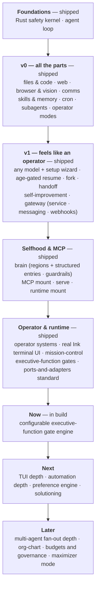
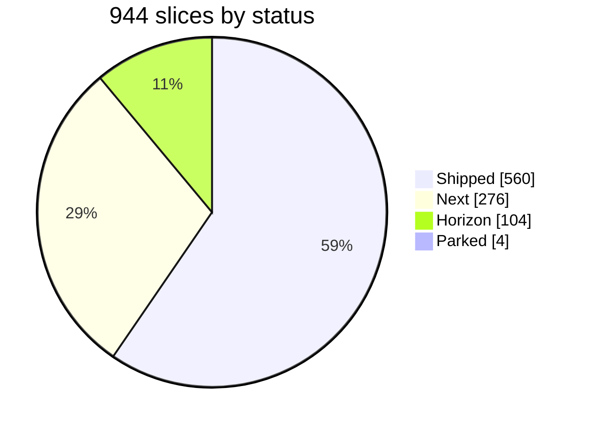
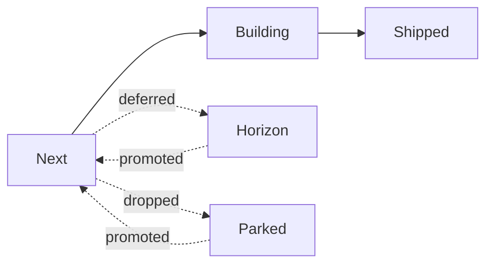

# Roadmap

Vanta ships as an ordered backlog of small, verified slices (tracked in `roadmap.json`). This is the product-level view: where it's been, what's in flight, and what's ahead.

## Now · Next · Later

| **Now** (in build) | **Next** (queued) | **Later** (horizon) |
|--------------------|-------------------|----------------------|
| User-facing, configurable executive-function gate engine | Terminal-UI depth — vim-mode composer, richer status line, multi-agent progress visibility | Isolated git-worktree workspaces for parallel agents |
| | Automation depth — richer hook types & event coverage | Multi-agent plan execution |
| | Mission-control shell rails (state · safety · working-memory · telemetry) | Swarm backends & peer-agent discovery |
| | Preference / "want" engine — learn and apply operator preferences | Deeper session-memory compaction into durable files |
| | Solutioning depth — stronger what-to-build recommendations | Template/pattern injection for common task shapes |

## Milestone timeline

## Status mix

A slice is *shipped* only when its done-criterion holds — tests green, behavior verified.

## The five pillars

Work is organized under five strategy pillars, in priority order (earlier ones are load-bearing for later):

1. **Harness** — the agent runtime: loop, prompt, tools, safety, TUI, sessions, discipline.
2. **Operator** — acting across your systems: world, money, radar, teams, search, self-repair, reach.
3. **Solutioning** — deciding *what* to build before building it.
4. **Extensibility** — swappable seams: providers, tools, search, MCP, plugins.
5. **Cofounder engine** — fan out and run a company of sub-agents for *one owner*: org chart, budgets, governance, heartbeats — all kernel-gated. (Multi-tenancy — serving other people as a business — stays parked.)

| Pillar | Slices |
|--------|-------:|
| Harness | 444 |
| Operator | 417 |
| Extensibility | 55 |
| Solutioning | 10 |
| Cofounder engine | 18 |

## How statuses move

- **Next** — queued, buildable now · **Building** — in progress (one at a time) · **Shipped** — done + verified
- **Horizon** — deferred until a prerequisite exists · **Parked** — set aside with a documented cost-to-revisit; promoted, never silently dropped

## Working principles

- One feature end-to-end before the next; refactors come after a slice ships.
- Decisions are append-only and not re-litigated without new information.
- The kernel boundary (Rule Zero) holds on every slice — see [Safety model](./safety-model.md).

> Counts reflect the latest `roadmap.json` snapshot and move as work lands.
