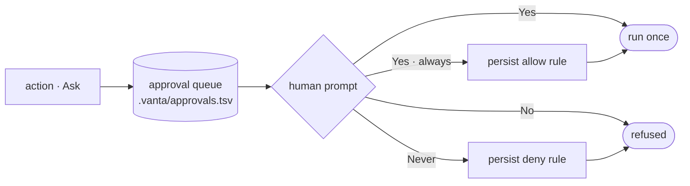

# Safety model

Vanta's safety guarantee is structural, not advisory. The agent layer asks the kernel to classify every action, and it has no path to execute an action the kernel blocks.

## Rule Zero

> No deletes, overwrites, out-of-scope writes, or secret handling without explicit approval.

This is enforced by the kernel on every tool call — not a guideline the model is asked to follow.

## The three verdicts

Every action is classified into exactly one tier:

| Verdict | Meaning | What happens |
|---------|---------|--------------|
| **Allow** | In-scope, no risk keywords, reversible | Runs immediately |
| **Ask** | Out-of-scope, system/credential touch, or irreversible | Pauses for human approval |
| **Block** | Destructive or exfiltration | Refused — never executes |

The **Block floor runs first** and is never downgraded. After it, a scope check escalates out-of-root actions to `Ask`. Finally a **reversibility pass** looks at the `Allow` tail: irreversible operations (push, migrate, publish, deploy, history rewrite) escalate `Allow → Ask`, while read-only and reversible operations (including file writes, which are reversible authoring) stay `Allow`.

## Scope

The kernel is rooted at a working directory (overridable with `VANTA_ROOT`). Actions that touch paths outside that root are escalated to `Ask` — the agent can't silently write to your home directory or another project.

## Approvals

When an action lands on `Ask`, it enters the approval queue, persisted to `.vanta/approvals.tsv`. In an interactive session you get a per-tool prompt (Yes / Yes-don't-ask-again / No / Never). The "always" and "never" choices persist tool-scoped rules — but a kernel **Block** can never be turned into an allow.

## Why a separate kernel

Keeping the boundary in a small, zero-dependency Rust process means:

- The safety logic is auditable in isolation, separate from the much larger agent loop.
- A bug in the TypeScript layer cannot grant itself more authority — it can only ask.
- The decision log (`.vanta/events.jsonl`) is an independent record of what was assessed and what ran.

## The approval lifecycle

An `Ask` enters the queue and waits for you. `Always` / `Never` persist a tool-scoped rule for next time — but a kernel **Block** is never offered as an allow.

